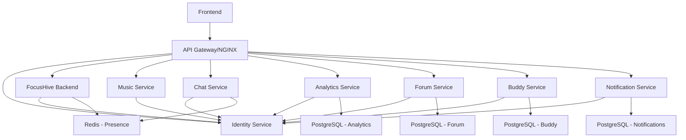
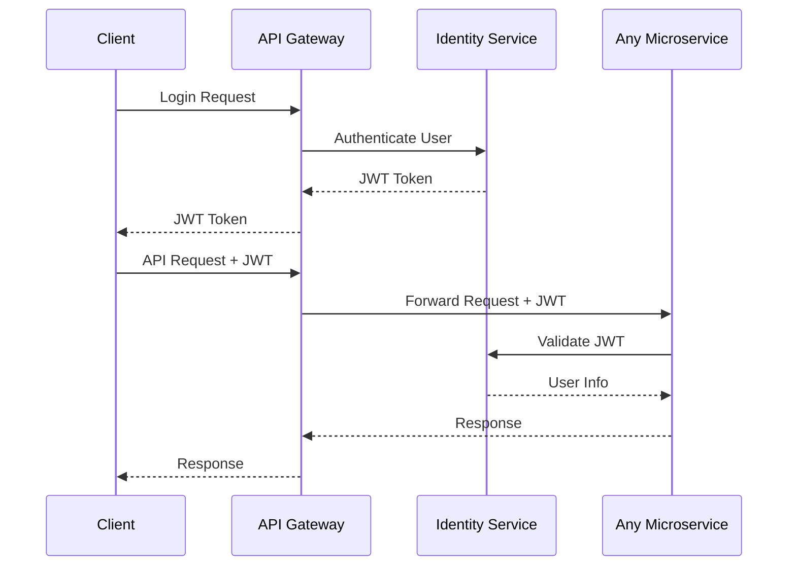

# FocusHive Microservices Migration Guide

## Overview

This document details the comprehensive migration process from FocusHive's monolithic architecture to a distributed microservices architecture. The migration was driven by critical build failures, scalability requirements, and the need for independent service development.

## Migration Strategy

### 1. **Strangler Fig Pattern Implementation**

The migration followed the **Strangler Fig Pattern**, gradually extracting services from the monolith while maintaining system functionality throughout the process.

#### Phase 1: Infrastructure Foundation
- Set up containerized development environment with Docker Compose
- Establish service discovery through container networking
- Implement API gateway pattern with NGINX
- Create shared infrastructure (Redis, logging, monitoring)

#### Phase 2: Identity Service Extraction (Week 1)
- **Rationale**: Authentication is a foundational capability required by all other services
- **Approach**: Extract OAuth2 and JWT functionality into dedicated service
- **Database**: Separate PostgreSQL database for user identity data
- **Integration**: Implement JWT token validation across remaining monolith

#### Phase 3: Specialized Services Extraction (Weeks 2-4)
- **Music Service**: Spotify integration and collaborative playlists
- **Notification Service**: Multi-channel notification delivery
- **Chat Service**: Real-time messaging with WebSocket support
- **Analytics Service**: Productivity tracking and reporting
- **Forum Service**: Community discussions and forums
- **Buddy Service**: Accountability partner matching

#### Phase 4: Core Service Refinement (Week 5)
- **FocusHive Backend**: Retain core hive management and presence functionality
- **API Cleanup**: Remove extracted functionality from main backend
- **Integration Testing**: End-to-end testing across all services

## Service Boundaries and Domain Decomposition

### Domain-Driven Design Principles

The service boundaries were defined using Domain-Driven Design (DDD) principles:

#### 1. **Bounded Contexts**
Each service represents a distinct bounded context with:
- Clear business responsibility
- Independent data model
- Autonomous decision-making capability
- Minimal coupling with other contexts

#### 2. **Service Definitions**

| Service | Bounded Context | Core Responsibility |
|---------|----------------|-------------------|
| **Identity Service** | User Identity Management | Authentication, authorization, user profiles |
| **FocusHive Backend** | Core Productivity | Hive management, presence tracking, timers |
| **Music Service** | Collaborative Audio | Spotify integration, shared playlists |
| **Chat Service** | Real-time Communication | Messaging, notifications, WebSocket connections |
| **Analytics Service** | Productivity Intelligence | Metrics, insights, reporting, achievements |
| **Forum Service** | Community Interaction | Discussions, posts, community features |
| **Buddy Service** | Accountability Network | Partner matching, check-ins, support |
| **Notification Service** | Multi-channel Delivery | Email, push, in-app notification routing |

#### 3. **Dependency Mapping**

## Data Management Strategy

### Database per Service Pattern

Each service maintains its own dedicated database to ensure:
- **Data Ownership**: Clear responsibility for data integrity
- **Schema Independence**: Services can evolve their data models independently
- **Technology Flexibility**: Different services can use optimal database technologies
- **Fault Isolation**: Database issues don't cascade across services

#### Database Allocation

| Service | Database | Port | Purpose |
|---------|----------|------|---------|
| FocusHive Backend | `focushive` | 5434 | Hives, users, presence, timers |
| Identity Service | `identity_db` | 5433 | User authentication, profiles, OAuth2 |
| Music Service | `focushive_music` | 5435 | Playlists, Spotify tokens, preferences |
| Chat Service | `chat_service` | 5437 | Messages, conversations, channels |
| Analytics Service | `analytics_service` | 5438 | Metrics, sessions, achievements |
| Forum Service | `forum_service` | 5439 | Posts, replies, categories |
| Buddy Service | `buddy_service` | 5440 | Partners, check-ins, goals |
| Notification Service | `notification_service` | 5436 | Templates, preferences, delivery logs |

### Data Consistency Strategy

#### 1. **Eventual Consistency**
- Accept eventual consistency between services for non-critical data
- Use event-driven architecture for data synchronization
- Implement compensating transactions for failure scenarios

#### 2. **Data Duplication**
- Strategic data duplication to reduce inter-service dependencies
- Maintain user basic information (id, name) in services that need it
- Use event sourcing to keep duplicated data synchronized

#### 3. **Shared Reference Data**
- User identities managed centrally by Identity Service
- Other services store only user IDs and fetch details when needed
- Cache frequently accessed reference data locally

## Inter-Service Communication Patterns

### 1. **Synchronous Communication**

#### REST API Calls
- **Use Case**: Request-response operations requiring immediate consistency
- **Implementation**: HTTP/HTTPS with JSON payloads
- **Security**: JWT tokens for authentication
- **Error Handling**: Circuit breaker pattern for resilience

#### API Contract Management
- **OpenAPI Specifications**: All services provide OpenAPI/Swagger documentation
- **Version Management**: API versioning strategy (v1, v2) for backward compatibility
- **Contract Testing**: Consumer-driven contract testing between services

### 2. **Asynchronous Communication**

#### Redis Pub/Sub
- **Use Case**: Real-time events (presence updates, chat messages)
- **Implementation**: Redis channels for event distribution
- **Scalability**: Horizontal scaling through Redis clustering
- **Reliability**: Message persistence for critical events

#### Event-Driven Architecture
- **Domain Events**: Services publish events for significant business occurrences
- **Event Store**: Persistent event log for audit and replay capabilities
- **Saga Pattern**: Coordinate distributed transactions across services

### 3. **Communication Protocols**

| Communication Type | Protocol | Use Cases | Examples |
|-------------------|----------|-----------|----------|
| **Synchronous** | HTTP/REST | Data queries, commands | User authentication, hive creation |
| **Real-time** | WebSockets | Live updates, chat | Presence updates, chat messages |
| **Asynchronous** | Redis Pub/Sub | Event notification | User status changes, notifications |
| **Batch** | HTTP/REST | Periodic data sync | Analytics aggregation, reporting |

## Authentication and Authorization Flow

### 1. **Centralized Authentication**

The Identity Service serves as the central authentication authority:

### 2. **JWT Token Strategy**

#### Token Structure
- **Issuer**: Identity Service URL
- **Audience**: Service-specific or general
- **Claims**: User ID, roles, permissions, expiration
- **Signing**: RS256 asymmetric signing for distributed validation

#### Token Validation
- **Local Validation**: Services validate JWT signatures locally
- **User Context**: Extract user information from JWT claims
- **Refresh Mechanism**: Automatic token refresh for long-running sessions

### 3. **Service-to-Service Authentication**

#### Internal API Security
- **Service Accounts**: Dedicated authentication for inter-service calls
- **API Keys**: Secure service-to-service communication
- **Network Security**: Container network isolation
- **Rate Limiting**: Prevent service abuse and ensure fair resource allocation

## Challenges Encountered and Solutions

### 1. **Database Migration Challenges**

#### Challenge: Data Partitioning
- **Problem**: Existing monolithic database had intertwined data relationships
- **Solution**: Gradual data migration with data duplication during transition
- **Approach**: Created migration scripts to partition data by service boundaries

#### Challenge: Referential Integrity
- **Problem**: Foreign key relationships across service boundaries
- **Solution**: Replace foreign keys with service calls or eventual consistency
- **Implementation**: User IDs as references instead of database foreign keys

### 2. **Service Discovery and Communication**

#### Challenge: Service Location
- **Problem**: Services need to find and communicate with each other
- **Solution**: Docker Compose networking with service names as hostnames
- **Benefits**: Automatic service discovery within container network

#### Challenge: Network Reliability
- **Problem**: Network failures between services
- **Solution**: Implement retry logic, circuit breakers, and graceful degradation
- **Libraries**: Spring Cloud components for resilience patterns

### 3. **Development Environment Complexity**

#### Challenge: Local Development Setup
- **Problem**: Running 8+ services locally is resource-intensive
- **Solution**: Docker Compose with selective service startup
- **Optimization**: Health checks and dependency management

#### Challenge: Debugging Distributed Systems
- **Problem**: Tracing issues across multiple services
- **Solution**: Centralized logging with correlation IDs
- **Tools**: Structured logging with service identifiers

### 4. **Data Consistency Issues**

#### Challenge: Distributed Transactions
- **Problem**: Maintaining ACID properties across services
- **Solution**: Adopt eventual consistency and saga pattern
- **Implementation**: Event-driven data synchronization

#### Challenge: Cache Invalidation
- **Problem**: Keeping cached data consistent across services
- **Solution**: TTL-based cache expiration and event-driven invalidation
- **Strategy**: Cache frequently accessed, slowly changing data

## Implementation Timeline

### Week 1: Foundation and Identity Service
- **Days 1-2**: Docker Compose infrastructure setup
- **Days 3-4**: Identity Service extraction and OAuth2 implementation
- **Days 5-7**: JWT integration across remaining monolith

### Week 2: Communication and Music Services
- **Days 1-2**: Chat Service extraction with WebSocket support
- **Days 3-4**: Music Service extraction with Spotify integration
- **Days 5-7**: Inter-service communication testing

### Week 3: Analytics and Community Services
- **Days 1-2**: Analytics Service extraction with metrics aggregation
- **Days 3-4**: Forum Service extraction with community features
- **Days 5-7**: Database migrations and data consistency validation

### Week 4: Buddy and Notification Services
- **Days 1-2**: Buddy Service extraction with matching algorithms
- **Days 3-4**: Notification Service extraction with multi-channel delivery
- **Days 5-7**: End-to-end integration testing

### Week 5: Core Service Refinement and Documentation
- **Days 1-2**: FocusHive Backend cleanup and optimization
- **Days 3-4**: API documentation and contract testing
- **Days 5-7**: Performance testing and monitoring setup

## Performance Impact and Optimization

### 1. **Performance Metrics**

#### Before Migration (Monolith)
- **Build Time**: 3-5 minutes for full application
- **Startup Time**: 45-60 seconds
- **Resource Usage**: 2GB RAM, 4 CPU cores for entire application
- **Deployment Time**: 10-15 minutes with full system restart

#### After Migration (Microservices)
- **Build Time**: 30-60 seconds per service (parallel builds possible)
- **Startup Time**: 15-30 seconds per service
- **Resource Usage**: 200-500MB RAM per service (optimized allocation)
- **Deployment Time**: 2-5 minutes per service (independent deployments)

### 2. **Optimization Strategies**

#### Container Optimization
- **Multi-stage Builds**: Minimize image sizes with build/runtime separation
- **Base Image Selection**: Use Alpine Linux for smaller footprint
- **Resource Limits**: Set appropriate CPU and memory limits per service

#### Database Optimization
- **Connection Pooling**: Optimize database connections per service
- **Query Optimization**: Service-specific database query tuning
- **Indexing Strategy**: Targeted indexes for service-specific queries

#### Network Optimization
- **Connection Reuse**: HTTP connection pooling for inter-service calls
- **Caching Strategy**: Redis caching for frequently accessed data
- **Compression**: Enable gzip compression for API responses

## Monitoring and Observability

### 1. **Health Monitoring**

#### Service Health Checks
- **Endpoint**: `/actuator/health` for each service
- **Dependencies**: Check database and Redis connectivity
- **Docker Integration**: Health checks in Docker Compose
- **Alerting**: Automated alerts for service failures

#### System Monitoring
- **Resource Monitoring**: CPU, memory, disk usage per service
- **Network Monitoring**: Inter-service communication latency
- **Database Monitoring**: Connection pools, query performance
- **Application Metrics**: Custom business metrics per service

### 2. **Logging Strategy**

#### Centralized Logging
- **Log Aggregation**: All services log to shared volume
- **Structured Logging**: JSON format with consistent fields
- **Correlation IDs**: Request tracing across service boundaries
- **Log Levels**: Configurable logging levels per service

#### Log Analysis
- **Error Tracking**: Centralized error monitoring and alerting
- **Performance Analysis**: Response time and throughput metrics
- **User Activity**: Audit trails for compliance and debugging
- **Security Monitoring**: Authentication failures and suspicious activity

## Testing Strategy

### 1. **Unit Testing**

#### Service-Level Testing
- **Isolated Testing**: Each service tested independently
- **Mock Dependencies**: Mock external service dependencies
- **Coverage Targets**: 80%+ code coverage per service
- **Fast Feedback**: Quick test execution for development workflow

### 2. **Integration Testing**

#### Contract Testing
- **Consumer-Driven Contracts**: Test API contracts between services
- **API Testing**: Validate REST endpoints and data contracts
- **Database Testing**: Test data access layer with test databases
- **External Integration**: Test third-party integrations (Spotify, etc.)

### 3. **End-to-End Testing**

#### System Testing
- **Full Workflow Testing**: Test complete user journeys across services
- **Performance Testing**: Load testing with realistic traffic patterns
- **Chaos Engineering**: Test system resilience with service failures
- **Security Testing**: Penetration testing and vulnerability scanning

## Lessons Learned

### 1. **Technical Lessons**

#### Service Boundaries
- **Importance**: Careful domain boundary definition prevents future refactoring
- **Evolution**: Service boundaries may need adjustment as system evolves
- **Data Ownership**: Clear data ownership prevents conflicts and confusion

#### Communication Patterns
- **Synchronous vs Asynchronous**: Choose appropriate communication pattern for use case
- **Network Reliability**: Always assume network failures and design accordingly
- **Performance**: Network calls have latency; minimize unnecessary communication

### 2. **Operational Lessons**

#### Development Process
- **Automation**: Invest heavily in automation for complex distributed systems
- **Documentation**: Clear API documentation is critical for team coordination
- **Testing**: Comprehensive testing strategy is essential for system reliability

#### Deployment Strategy
- **Independent Deployments**: Major benefit but requires careful dependency management
- **Rollback Strategy**: Each service needs independent rollback capability
- **Monitoring**: Distributed systems require sophisticated monitoring and alerting

### 3. **Organizational Lessons**

#### Team Structure
- **Service Ownership**: Clear ownership model prevents confusion and conflicts
- **Cross-team Communication**: Regular sync meetings essential for distributed teams
- **Knowledge Sharing**: Documentation and knowledge sharing become more critical

## Future Enhancements

### 1. **Short-term Improvements** (Next 3 months)

#### Observability Enhancement
- **Distributed Tracing**: Implement Jaeger or Zipkin for request tracing
- **Metrics Dashboard**: Grafana dashboards for system monitoring
- **Log Analysis**: ELK stack for advanced log search and analysis

#### Security Hardening
- **Service Mesh**: Consider Istio for advanced security and traffic management
- **Secrets Management**: Implement HashiCorp Vault for credential management
- **Network Segmentation**: Fine-grained network security policies

### 2. **Medium-term Evolution** (3-6 months)

#### Platform Migration
- **Kubernetes**: Migration from Docker Compose to Kubernetes
- **CI/CD Pipeline**: Automated testing and deployment pipelines
- **Infrastructure as Code**: Terraform for infrastructure management

#### Advanced Patterns
- **Event Sourcing**: Implement event sourcing for audit and replay capabilities
- **CQRS**: Command Query Responsibility Segregation for read/write optimization
- **API Gateway**: Replace NGINX with dedicated API gateway (Kong, Ambassador)

### 3. **Long-term Vision** (6+ months)

#### Scalability Enhancement
- **Auto-scaling**: Horizontal pod autoscaling based on metrics
- **Multi-region**: Geographic distribution for global user base
- **CDN Integration**: Content delivery network for static assets

#### Advanced Analytics
- **Machine Learning**: Integrate ML models for user behavior prediction
- **Real-time Analytics**: Stream processing for real-time insights
- **Data Pipeline**: ETL pipelines for data warehouse integration

---

**Document Version**: 1.0  
**Last Updated**: January 2025  
**Authors**: FocusHive Development Team  
**Next Review**: March 2025