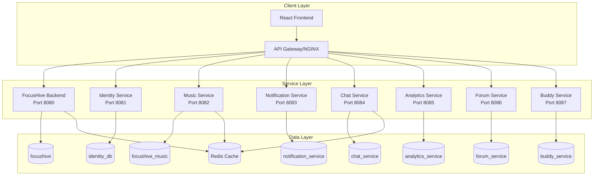

# FocusHive Microservices Service Catalog

## Overview

FocusHive is composed of 8 specialized microservices, each responsible for distinct business capabilities. This catalog provides comprehensive documentation for each service including purpose, API endpoints, database schema, dependencies, and operational characteristics.

## Service Architecture Overview

---

## 1. FocusHive Backend Service

### Overview
**Port**: 8080  
**Repository**: `/services/focushive-backend`  
**Responsibility**: Core business logic for hive management, user coordination, presence tracking, and timer functionality

### Purpose and Responsibilities
- **Hive Management**: Create, configure, and manage virtual co-working spaces
- **User Coordination**: Manage hive memberships and permissions
- **Presence Tracking**: Real-time user status and activity monitoring
- **Timer Functionality**: Pomodoro timers and focus session management
- **WebSocket Hub**: Central WebSocket coordination for real-time features

### Technology Stack
- **Framework**: Spring Boot 3.x
- **Language**: Java 21
- **Database**: PostgreSQL (focushive)
- **Cache**: Redis (shared)
- **Real-time**: Spring WebSocket with STOMP
- **Authentication**: JWT validation via Identity Service

### Key API Endpoints

| Method | Endpoint | Purpose |
|--------|----------|---------|
| `POST` | `/api/v1/hives` | Create new hive |
| `GET` | `/api/v1/hives/{id}` | Get hive details |
| `PUT` | `/api/v1/hives/{id}` | Update hive settings |
| `DELETE` | `/api/v1/hives/{id}` | Delete hive |
| `POST` | `/api/v1/hives/{id}/join` | Join hive |
| `POST` | `/api/v1/hives/{id}/leave` | Leave hive |
| `GET` | `/api/v1/hives/{id}/members` | Get hive members |
| `POST` | `/api/v1/presence/update` | Update user presence |
| `GET` | `/api/v1/presence/hive/{id}` | Get hive presence |
| `POST` | `/api/v1/timers/start` | Start focus timer |
| `POST` | `/api/v1/timers/{id}/stop` | Stop focus timer |

### WebSocket Endpoints
- **Main Endpoint**: `/ws`
- **STOMP Destinations**:
  - `/app/presence/update` - Update user presence
  - `/topic/hive/{id}/presence` - Hive presence updates
  - `/topic/hive/{id}/timers` - Timer synchronization
  - `/user/queue/notifications` - Personal notifications

### Database Schema (Key Tables)
- `users` - Basic user information
- `hives` - Virtual co-working spaces
- `hive_members` - Hive membership relationships
- `hive_settings` - Hive configuration
- `user_presence` - Real-time presence status
- `focus_sessions` - Timer sessions and productivity data

### Dependencies
- **Identity Service**: User authentication and validation
- **Redis**: Real-time presence data and caching
- **PostgreSQL**: Persistent data storage

### Scaling Characteristics
- **CPU**: Moderate (real-time processing)
- **Memory**: 512MB-1GB (WebSocket connections)
- **Network**: High (WebSocket traffic)
- **Storage**: Low-Medium (session data)

---

## 2. Identity Service

### Overview
**Port**: 8081  
**Repository**: `/services/identity-service`  
**Responsibility**: Advanced identity management, OAuth2 provider, and multi-persona user profiles

### Purpose and Responsibilities
- **OAuth2 Authorization Server**: Full OAuth2/OIDC provider capabilities
- **Multi-Persona Management**: Support work, personal, gaming, and custom user personas
- **JWT Authentication**: Token-based authentication with refresh capability
- **Context-Aware Identity**: Automatic persona switching based on context
- **Privacy Controls**: Granular data sharing and visibility permissions
- **Data Portability**: Export/import user data per persona

### Technology Stack
- **Framework**: Spring Boot 3.x + Spring Authorization Server
- **Language**: Java 21
- **Database**: PostgreSQL (identity_db)
- **Cache**: Redis (dedicated instance)
- **Security**: RSA key signing for JWT tokens
- **Standards**: OAuth2, OpenID Connect, JWT

### Key API Endpoints

| Method | Endpoint | Purpose |
|--------|----------|---------|
| `POST` | `/api/v1/auth/register` | User registration |
| `POST` | `/api/v1/auth/login` | User authentication |
| `POST` | `/api/v1/auth/refresh` | Token refresh |
| `GET` | `/api/v1/users/me` | Current user profile |
| `PUT` | `/api/v1/users/me` | Update user profile |
| `GET` | `/api/v1/personas` | List user personas |
| `POST` | `/api/v1/personas` | Create new persona |
| `PUT` | `/api/v1/personas/{id}` | Update persona |
| `POST` | `/api/v1/personas/{id}/activate` | Switch to persona |
| `GET` | `/api/v1/privacy/settings` | Privacy configuration |
| `POST` | `/api/v1/data/export` | Data portability export |

### OAuth2 Endpoints
- `/oauth2/authorize` - Authorization endpoint
- `/oauth2/token` - Token endpoint
- `/oauth2/introspect` - Token introspection
- `/oauth2/revoke` - Token revocation
- `/oauth2/jwks` - JSON Web Key Set
- `/.well-known/openid-configuration` - OpenID discovery

### Database Schema (Key Tables)
- `users` - Core user accounts
- `user_profiles` - Detailed user information
- `personas` - Multiple personas per user
- `persona_contexts` - Context-based persona activation
- `privacy_settings` - Granular privacy controls
- `oauth2_clients` - Registered OAuth2 clients
- `oauth2_authorizations` - Authorization grants
- `oauth2_refresh_tokens` - Refresh token storage

### Dependencies
- **PostgreSQL**: User identity and OAuth2 data
- **Redis**: Session management and token caching
- **External**: None (foundational service)

### Scaling Characteristics
- **CPU**: Low-Medium (cryptographic operations)
- **Memory**: 256MB-512MB
- **Network**: Medium (authentication traffic)
- **Storage**: Medium (user data and tokens)

---

## 3. Music Service

### Overview
**Port**: 8082  
**Repository**: `/services/music-service`  
**Responsibility**: Spotify integration, collaborative playlists, and focus music recommendations

### Purpose and Responsibilities
- **Spotify Integration**: Connect and authenticate with Spotify API
- **Collaborative Playlists**: Shared playlists within hives
- **Music Recommendations**: AI-powered focus music suggestions
- **Playback Control**: Synchronized playback across hive members
- **Mood-Based Selection**: Music selection based on work context and mood

### Technology Stack
- **Framework**: Spring Boot 3.x
- **Language**: Java 21
- **Database**: PostgreSQL (focushive_music)
- **Cache**: Redis (dedicated instance)
- **External API**: Spotify Web API
- **Circuit Breaker**: Resilience4j for external API resilience

### Key API Endpoints

| Method | Endpoint | Purpose |
|--------|----------|---------|
| `GET` | `/api/v1/music/spotify/auth` | Spotify OAuth flow |
| `POST` | `/api/v1/music/spotify/callback` | Spotify OAuth callback |
| `GET` | `/api/v1/music/recommendations` | Get music recommendations |
| `POST` | `/api/v1/music/playlists` | Create hive playlist |
| `GET` | `/api/v1/music/playlists/{id}` | Get playlist details |
| `POST` | `/api/v1/music/playlists/{id}/tracks` | Add track to playlist |
| `DELETE` | `/api/v1/music/playlists/{id}/tracks/{trackId}` | Remove track |
| `POST` | `/api/v1/music/playback/play` | Start playback |
| `POST` | `/api/v1/music/playback/pause` | Pause playback |
| `POST` | `/api/v1/music/mood` | Set mood preferences |

### Database Schema (Key Tables)
- `spotify_tokens` - User Spotify authentication tokens
- `playlists` - Collaborative playlists
- `playlist_tracks` - Tracks within playlists
- `music_preferences` - User music preferences
- `recommendation_history` - Previous recommendations for learning
- `playback_sessions` - Synchronized playback sessions

### Dependencies
- **Identity Service**: User authentication
- **Spotify API**: Music data and playback control
- **PostgreSQL**: Music preferences and playlists
- **Redis**: Caching recommendations and session data

### Scaling Characteristics
- **CPU**: Medium (API calls and recommendations)
- **Memory**: 256MB-512MB
- **Network**: High (Spotify API traffic)
- **Storage**: Low (mostly references to Spotify content)

---

## 4. Notification Service

### Overview
**Port**: 8083  
**Repository**: `/services/notification-service`  
**Responsibility**: Multi-channel notification delivery including email, push, and in-app notifications

### Purpose and Responsibilities
- **Multi-Channel Delivery**: Email, push notifications, and in-app messages
- **Template Management**: Notification templates with personalization
- **Delivery Scheduling**: Immediate and scheduled notification delivery
- **User Preferences**: Granular notification preferences per channel
- **Delivery Tracking**: Notification delivery status and analytics
- **Rate Limiting**: Prevent notification spam and respect user limits

### Technology Stack
- **Framework**: Spring Boot 3.x
- **Language**: Java 21
- **Database**: PostgreSQL (notification_service)
- **Cache**: Redis (shared for rate limiting)
- **Email**: SMTP integration
- **Push**: Firebase Cloud Messaging (FCM)
- **Queuing**: Redis for notification queuing

### Key API Endpoints

| Method | Endpoint | Purpose |
|--------|----------|---------|
| `POST` | `/api/v1/notifications/send` | Send immediate notification |
| `POST` | `/api/v1/notifications/schedule` | Schedule notification |
| `GET` | `/api/v1/notifications/history` | User notification history |
| `PUT` | `/api/v1/notifications/{id}/read` | Mark notification as read |
| `GET` | `/api/v1/notifications/preferences` | Get user preferences |
| `PUT` | `/api/v1/notifications/preferences` | Update preferences |
| `GET` | `/api/v1/notifications/templates` | List templates |
| `POST` | `/api/v1/notifications/templates` | Create template |
| `GET` | `/api/v1/notifications/stats` | Delivery statistics |

### Database Schema (Key Tables)
- `notification_templates` - Message templates
- `notification_preferences` - User channel preferences
- `notifications` - Notification records
- `delivery_logs` - Delivery attempt tracking
- `notification_stats` - Aggregated delivery statistics
- `rate_limits` - Rate limiting configuration

### Dependencies
- **Identity Service**: User authentication and preferences
- **Redis**: Queuing and rate limiting
- **SMTP Server**: Email delivery
- **FCM**: Push notification delivery

### Scaling Characteristics
- **CPU**: Medium (template processing and delivery)
- **Memory**: 256MB-512MB
- **Network**: Medium-High (external delivery services)
- **Storage**: Medium (notification history and templates)

---

## 5. Chat Service

### Overview
**Port**: 8084  
**Repository**: `/services/chat-service`  
**Responsibility**: Real-time messaging, chat channels, and communication features

### Purpose and Responsibilities
- **Real-time Messaging**: WebSocket-based instant messaging
- **Channel Management**: Public hive channels and private conversations
- **Message History**: Persistent message storage and retrieval
- **File Sharing**: Image and file attachment support
- **Typing Indicators**: Real-time typing status
- **Message Threading**: Reply and conversation threading
- **Moderation Tools**: Message moderation and reporting

### Technology Stack
- **Framework**: Spring Boot 3.x
- **Language**: Java 21
- **Database**: PostgreSQL (chat_service)
- **Cache**: Redis (shared for real-time data)
- **WebSocket**: Spring WebSocket with STOMP
- **File Storage**: Local filesystem or cloud storage integration

### Key API Endpoints

| Method | Endpoint | Purpose |
|--------|----------|---------|
| `GET` | `/api/v1/chat/channels` | List user channels |
| `POST` | `/api/v1/chat/channels` | Create new channel |
| `GET` | `/api/v1/chat/channels/{id}/messages` | Get message history |
| `POST` | `/api/v1/chat/channels/{id}/messages` | Send message |
| `PUT` | `/api/v1/chat/messages/{id}` | Edit message |
| `DELETE` | `/api/v1/chat/messages/{id}` | Delete message |
| `POST` | `/api/v1/chat/messages/{id}/react` | Add reaction |
| `POST` | `/api/v1/chat/upload` | Upload file attachment |
| `POST` | `/api/v1/chat/channels/{id}/join` | Join channel |
| `POST` | `/api/v1/chat/channels/{id}/leave` | Leave channel |

### WebSocket Endpoints
- **Connection**: `/ws/chat`
- **STOMP Destinations**:
  - `/app/chat/send` - Send message
  - `/app/chat/typing` - Typing indicator
  - `/topic/channel/{id}` - Channel messages
  - `/user/queue/private` - Private messages

### Database Schema (Key Tables)
- `chat_channels` - Chat channels and conversations
- `channel_members` - Channel membership
- `messages` - Chat messages
- `message_reactions` - Message reactions and emojis
- `message_attachments` - File attachments
- `typing_indicators` - Real-time typing status
- `message_threads` - Threaded conversations

### Dependencies
- **Identity Service**: User authentication
- **Redis**: Real-time messaging and presence
- **File Storage**: Attachment storage
- **PostgreSQL**: Message persistence

### Scaling Characteristics
- **CPU**: Medium-High (real-time processing)
- **Memory**: 512MB-1GB (WebSocket connections)
- **Network**: High (real-time messaging traffic)
- **Storage**: Medium-High (message history and files)

---

## 6. Analytics Service

### Overview
**Port**: 8085  
**Repository**: `/services/analytics-service`  
**Responsibility**: Productivity tracking, insights generation, and achievement management

### Purpose and Responsibilities
- **Session Tracking**: Focus session duration and quality metrics
- **Productivity Analytics**: Personal and team productivity insights
- **Achievement System**: Goals, streaks, and milestone tracking
- **Reporting**: Daily, weekly, and monthly productivity reports
- **Trend Analysis**: Productivity patterns and improvement suggestions
- **Leaderboards**: Gamified productivity competitions within hives

### Technology Stack
- **Framework**: Spring Boot 3.x
- **Language**: Java 21
- **Database**: PostgreSQL (analytics_service)
- **Cache**: Redis (shared for real-time metrics)
- **Scheduling**: Spring Scheduler for report generation
- **Analytics**: Custom metrics aggregation and analysis

### Key API Endpoints

| Method | Endpoint | Purpose |
|--------|----------|---------|
| `POST` | `/api/v1/analytics/sessions/start` | Start focus session |
| `POST` | `/api/v1/analytics/sessions/{id}/end` | End focus session |
| `GET` | `/api/v1/analytics/users/{id}/stats` | User productivity stats |
| `GET` | `/api/v1/analytics/users/{id}/achievements` | User achievements |
| `GET` | `/api/v1/analytics/hives/{id}/leaderboard` | Hive leaderboard |
| `GET` | `/api/v1/analytics/reports/daily` | Daily productivity report |
| `GET` | `/api/v1/analytics/reports/weekly` | Weekly productivity report |
| `POST` | `/api/v1/analytics/goals` | Set productivity goals |
| `GET` | `/api/v1/analytics/trends` | Productivity trends |
| `POST` | `/api/v1/analytics/events` | Track custom events |

### Database Schema (Key Tables)
- `focus_sessions` - Individual focus session records
- `productivity_metrics` - Aggregated productivity data
- `user_achievements` - Achievement tracking
- `productivity_goals` - User-defined goals
- `daily_summaries` - Daily productivity aggregates
- `leaderboards` - Hive-based leaderboard data
- `analytics_events` - Custom event tracking

### Dependencies
- **Identity Service**: User authentication
- **FocusHive Backend**: Session data integration
- **PostgreSQL**: Analytics data storage
- **Redis**: Real-time metrics caching

### Scaling Characteristics
- **CPU**: Medium (data aggregation and analysis)
- **Memory**: 256MB-512MB
- **Network**: Low-Medium (API traffic)
- **Storage**: High (historical analytics data)

---

## 7. Forum Service

### Overview
**Port**: 8086  
**Repository**: `/services/forum-service`  
**Responsibility**: Community forums, discussions, and knowledge sharing

### Purpose and Responsibilities
- **Discussion Forums**: Category-based discussion forums
- **Post Management**: Create, edit, and manage forum posts
- **Reply Threading**: Nested replies and conversation threading
- **Voting System**: Upvote/downvote posts and replies
- **Content Moderation**: Community moderation tools and reporting
- **Search**: Full-text search across forum content
- **Notifications**: Forum activity notifications

### Technology Stack
- **Framework**: Spring Boot 3.x
- **Language**: Java 21
- **Database**: PostgreSQL (forum_service)
- **Cache**: Redis (shared for caching popular content)
- **Search**: PostgreSQL full-text search
- **File Storage**: Attachment support for forum posts

### Key API Endpoints

| Method | Endpoint | Purpose |
|--------|----------|---------|
| `GET` | `/api/v1/forum/categories` | List forum categories |
| `POST` | `/api/v1/forum/categories` | Create category |
| `GET` | `/api/v1/forum/categories/{id}/posts` | Get category posts |
| `POST` | `/api/v1/forum/posts` | Create new post |
| `GET` | `/api/v1/forum/posts/{id}` | Get post details |
| `PUT` | `/api/v1/forum/posts/{id}` | Edit post |
| `DELETE` | `/api/v1/forum/posts/{id}` | Delete post |
| `POST` | `/api/v1/forum/posts/{id}/replies` | Reply to post |
| `POST` | `/api/v1/forum/posts/{id}/vote` | Vote on post |
| `GET` | `/api/v1/forum/search` | Search forum content |

### Database Schema (Key Tables)
- `forum_categories` - Forum categories and organization
- `forum_posts` - Main forum posts
- `forum_replies` - Replies to posts
- `forum_votes` - Voting records
- `forum_subscriptions` - User subscriptions to threads
- `forum_reports` - Content moderation reports
- `forum_attachments` - File attachments to posts

### Dependencies
- **Identity Service**: User authentication
- **Notification Service**: Forum activity notifications
- **PostgreSQL**: Forum content storage
- **Redis**: Content caching

### Scaling Characteristics
- **CPU**: Low-Medium (content serving and search)
- **Memory**: 256MB-512MB
- **Network**: Medium (content delivery)
- **Storage**: Medium-High (forum content and attachments)

---

## 8. Buddy Service

### Overview
**Port**: 8087  
**Repository**: `/services/buddy-service`  
**Responsibility**: Accountability partner matching, buddy system management, and peer support

### Purpose and Responsibilities
- **Partner Matching**: Algorithm-based accountability partner matching
- **Buddy Relationships**: Manage buddy partnerships and connections
- **Check-in System**: Regular accountability check-ins and progress sharing
- **Goal Sharing**: Shared goals and mutual accountability
- **Progress Tracking**: Track buddy progress and achievements
- **Support Network**: Building supportive peer relationships
- **Matching Preferences**: Customize partner matching criteria

### Technology Stack
- **Framework**: Spring Boot 3.x
- **Language**: Java 21
- **Database**: PostgreSQL (buddy_service)
- **Cache**: Redis (shared for matching algorithms)
- **Algorithms**: Custom matching algorithms based on preferences
- **Notifications**: Integration with notification service

### Key API Endpoints

| Method | Endpoint | Purpose |
|--------|----------|---------|
| `POST` | `/api/v1/buddy/preferences` | Set matching preferences |
| `GET` | `/api/v1/buddy/matches` | Get potential matches |
| `POST` | `/api/v1/buddy/requests` | Send buddy request |
| `POST` | `/api/v1/buddy/requests/{id}/accept` | Accept buddy request |
| `POST` | `/api/v1/buddy/requests/{id}/decline` | Decline buddy request |
| `GET` | `/api/v1/buddy/relationships` | List buddy relationships |
| `POST` | `/api/v1/buddy/checkins` | Record check-in |
| `GET` | `/api/v1/buddy/checkins/history` | Check-in history |
| `POST` | `/api/v1/buddy/goals/share` | Share goal with buddy |
| `GET` | `/api/v1/buddy/stats` | Buddy relationship stats |

### Database Schema (Key Tables)
- `buddy_preferences` - Matching preferences and criteria
- `buddy_matches` - Potential buddy matches
- `buddy_requests` - Buddy connection requests
- `buddy_relationships` - Active buddy partnerships
- `buddy_checkins` - Check-in records and accountability
- `buddy_goals` - Shared goals between buddies
- `buddy_sessions` - Joint focus sessions
- `relationship_stats` - Partnership effectiveness metrics

### Dependencies
- **Identity Service**: User authentication and profiles
- **Analytics Service**: Progress data for matching
- **Notification Service**: Buddy activity notifications
- **PostgreSQL**: Buddy relationship data

### Scaling Characteristics
- **CPU**: Medium (matching algorithms)
- **Memory**: 256MB-512MB
- **Network**: Low-Medium (API traffic)
- **Storage**: Medium (relationship and history data)

---

## Service Communication Matrix

| Service | Identity | Core | Music | Notify | Chat | Analytics | Forum | Buddy |
|---------|----------|------|-------|--------|------|-----------|-------|-------|
| **Identity** | - | ✓ | ✓ | ✓ | ✓ | ✓ | ✓ | ✓ |
| **Core** | ✓ | - | △ | △ | △ | ✓ | △ | △ |
| **Music** | ✓ | △ | - | △ | △ | △ | - | △ |
| **Notify** | ✓ | △ | △ | - | △ | △ | △ | ✓ |
| **Chat** | ✓ | △ | △ | △ | - | △ | △ | △ |
| **Analytics** | ✓ | ✓ | △ | △ | △ | - | △ | ✓ |
| **Forum** | ✓ | △ | - | ✓ | △ | △ | - | △ |
| **Buddy** | ✓ | △ | △ | ✓ | △ | ✓ | △ | - |

**Legend:**
- ✓ Direct API communication
- △ Event-based communication via Redis
- - No direct communication

## Operational Characteristics Summary

| Service | Memory | CPU | Network | Storage | Criticality |
|---------|--------|-----|---------|---------|-------------|
| **Identity** | 512MB | Medium | Medium | Medium | Critical |
| **Core** | 1GB | High | High | Medium | Critical |
| **Music** | 512MB | Medium | High | Low | Optional |
| **Notify** | 512MB | Medium | High | Medium | Important |
| **Chat** | 1GB | High | High | High | Important |
| **Analytics** | 512MB | Medium | Low | High | Important |
| **Forum** | 512MB | Low | Medium | High | Optional |
| **Buddy** | 512MB | Medium | Low | Medium | Optional |

## Health Check Endpoints

All services expose standardized health check endpoints:

- **Health**: `/{service}/actuator/health`
- **Metrics**: `/{service}/actuator/metrics`
- **Info**: `/{service}/actuator/info`
- **Prometheus**: `/{service}/actuator/prometheus`

## API Documentation

Each service provides OpenAPI documentation:

- **Swagger UI**: `http://localhost:{port}/swagger-ui.html`
- **OpenAPI JSON**: `http://localhost:{port}/api-docs`

---

**Document Version**: 1.0  
**Last Updated**: January 2025  
**Maintained By**: FocusHive Development Team  
**Next Review**: March 2025