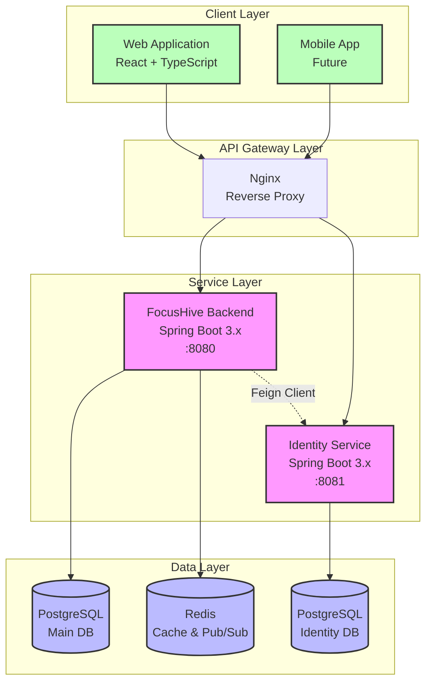
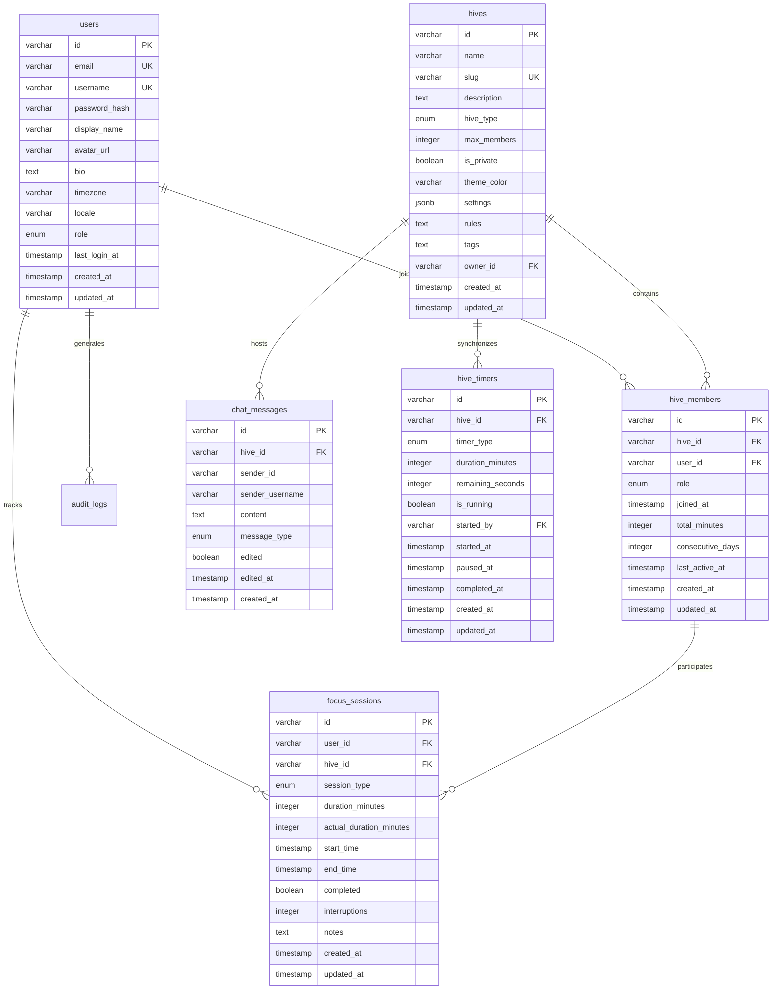
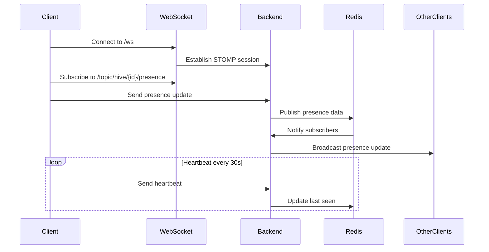
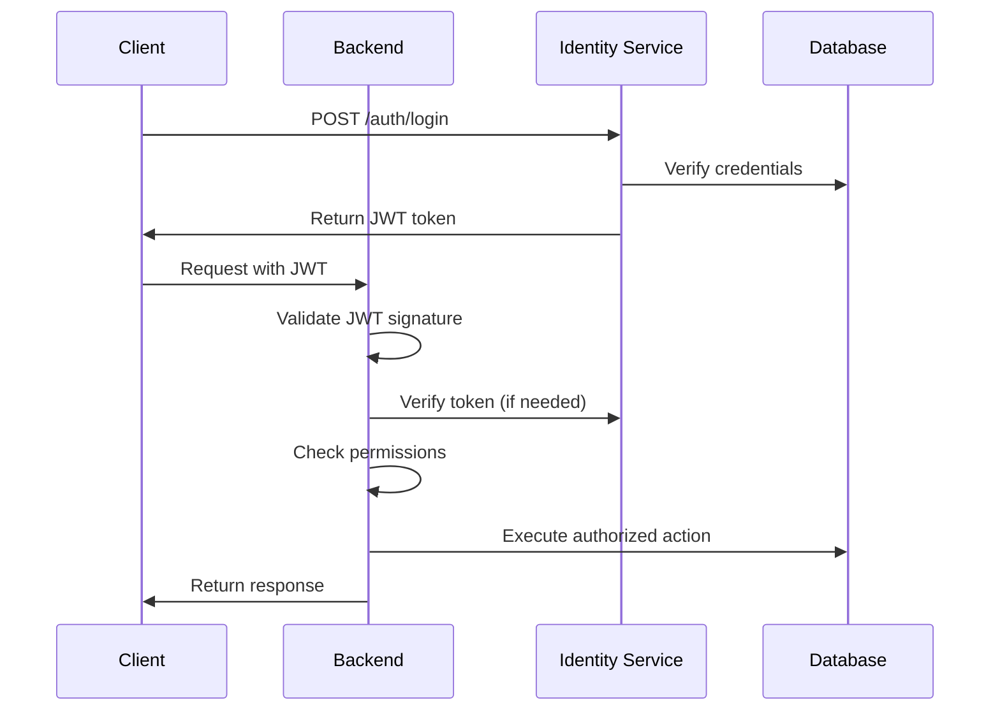

# Chapter 3: Design

## 3.1 Introduction

This chapter presents the comprehensive technical design of FocusHive, a digital co-working platform that addresses remote work isolation through virtual presence and collaborative features. The system architecture reflects careful consideration of scalability, real-time performance, and security requirements identified in the literature review. The design employs microservices architecture, event-driven patterns, and modern web technologies to create a responsive and reliable platform. This chapter details the system architecture, database design, API specifications, real-time communication infrastructure, and security implementation, providing a complete technical blueprint for the FocusHive platform.

## 3.2 System Architecture Overview

FocusHive employs a microservices architecture that separates concerns and enables independent scaling of components. The architecture consists of two primary services: the main FocusHive backend service handling core functionality, and a separate Identity Service managing authentication and user profiles. This separation follows the principle of bounded contexts from Domain-Driven Design, ensuring that identity management complexity does not pollute the core business logic.



The main backend service, implemented in Spring Boot 3.x with Java 21, handles all core business functionality including hive management, real-time presence, chat messaging, and productivity tracking. The service follows a domain-driven design approach with clear bounded contexts for each major feature area. The codebase organization in `/backend/src/main/java/com/focushive/` reflects this structure with feature-based packages: `hive`, `presence`, `chat`, `timer`, and `analytics`.

Communication between services utilizes Spring Cloud OpenFeign for synchronous REST calls, with Resilience4j providing circuit breaker patterns for fault tolerance. The Identity Service, while architecturally separate, integrates seamlessly through well-defined API contracts. Redis serves dual purposes: as a high-performance cache for frequently accessed data and as a pub/sub message broker for real-time features. This architecture enables horizontal scaling of individual services based on load patterns.

## 3.3 Database Design

The database schema reflects the domain model with careful attention to relationships and performance optimization. PostgreSQL was chosen for its robust support for complex queries, JSONB fields for flexible data storage, and excellent performance characteristics. The schema design prioritizes referential integrity while maintaining query efficiency through strategic indexing.



Database migrations are managed through Flyway, with versioned SQL scripts in `/backend/src/main/resources/db/migration/`. Each migration file follows the naming convention `V{version}__{description}.sql`, ensuring ordered execution and rollback capability. The initial migrations establish the core schema, with subsequent migrations adding features incrementally. This approach maintains database version control and enables safe schema evolution.

Key design decisions include using UUID strings for primary keys to support distributed ID generation, implementing soft deletes through timestamp fields for data recovery, and utilizing PostgreSQL's JSONB type for flexible settings storage. Indexes are strategically placed on foreign keys, frequently queried fields, and composite keys used in complex queries. The schema design balances normalization with query performance, denormalizing only where significant performance gains justify the data redundancy.

## 3.4 API Design

The API design follows RESTful principles with consistent naming conventions and predictable patterns. All endpoints are versioned under `/api/v1/` to support future API evolution without breaking existing clients. The design emphasizes resource-oriented URLs, appropriate HTTP methods, and meaningful status codes.

### REST Endpoint Structure

The REST API implements standard CRUD operations with additional domain-specific actions:

```
/api/v1/hives
  POST   /                 Create new hive
  GET    /                 List hives (paginated)
  GET    /{id}            Get hive details
  PUT    /{id}            Update hive
  DELETE /{id}            Delete hive
  POST   /{id}/join       Join a hive
  DELETE /{id}/leave      Leave a hive
  GET    /{id}/members    List hive members

/api/v1/timer
  POST   /sessions/start  Start focus session
  POST   /sessions/{id}/end    End session
  GET    /sessions/current      Get active session
  GET    /sessions/history      Get session history
  GET    /stats/daily          Daily statistics
  GET    /pomodoro/settings    Get user settings
  PUT    /pomodoro/settings    Update settings

/api/v1/presence
  GET    /hive/{hiveId}   Get hive presence info
  GET    /user/{userId}   Get user status
  POST   /heartbeat       Update presence
```

Request and response bodies utilize DTOs (Data Transfer Objects) for type safety and API contract clarity. Each DTO is carefully designed to expose only necessary information, preventing over-fetching and maintaining security boundaries. For example, the `HiveResponseDto` includes computed fields like member count and online members, aggregating data from multiple sources:

```java
// From /backend/src/main/java/com/focushive/hive/dto/HiveResponseDto.java
public class HiveResponseDto {
    private String id;
    private String name;
    private String slug;
    private String description;
    private HiveType hiveType;
    private Integer maxMembers;
    private Integer currentMembers;
    private Integer onlineMembers;
    private OwnerDto owner;
    private List<String> tags;
    private LocalDateTime createdAt;
}
```

### WebSocket Communication Design

Real-time features utilize WebSocket connections with STOMP (Simple Text Oriented Messaging Protocol) for structured messaging. This choice provides several advantages: automatic reconnection handling, message acknowledgment, and subscription-based routing. The WebSocket configuration in `/backend/src/main/java/com/focushive/presence/config/WebSocketConfig.java` establishes endpoints and message brokers:



Message routing follows a clear pattern: clients send messages to `/app` prefixed destinations, which route to `@MessageMapping` annotated methods in controllers. The backend processes these messages and broadcasts updates to `/topic` destinations, which clients subscribe to for real-time updates. This pub/sub model ensures efficient message distribution without tight coupling between clients.

## 3.5 Real-time Architecture

The real-time architecture addresses the critical requirement of maintaining presence awareness across distributed users. The design combines WebSocket connections for low-latency bidirectional communication with Redis pub/sub for horizontal scalability. This hybrid approach ensures that the system can scale beyond single-server limitations while maintaining sub-second update latency.

Presence tracking utilizes a heartbeat mechanism where clients send periodic updates every 30 seconds. The `PresenceService` implementation in `/backend/src/main/java/com/focushive/presence/service/impl/PresenceServiceImpl.java` maintains presence state in Redis with automatic expiration. This design gracefully handles client disconnections without requiring explicit cleanup:

```java
// Simplified presence tracking logic
public void updatePresence(String userId, String hiveId, PresenceStatus status) {
    String key = String.format("presence:%s:%s", hiveId, userId);
    PresenceData data = new PresenceData(userId, status, Instant.now());
    
    redisTemplate.opsForValue().set(key, data, Duration.ofSeconds(60));
    
    // Publish update for real-time distribution
    String channel = String.format("hive.%s.presence", hiveId);
    redisTemplate.convertAndSend(channel, data);
}
```

The Redis pub/sub mechanism enables multiple backend instances to share presence updates, supporting horizontal scaling. Each backend instance subscribes to relevant Redis channels based on active WebSocket connections, ensuring efficient message routing. This architecture maintains real-time responsiveness while supporting thousands of concurrent users across multiple server instances.

## 3.6 Security Architecture

Security design follows defense-in-depth principles with multiple layers of protection. The architecture separates authentication (verifying identity) from authorization (granting permissions), with the Identity Service handling authentication and the main backend enforcing authorization. This separation enables centralized identity management while maintaining service autonomy.



JWT (JSON Web Tokens) provide stateless authentication, enabling horizontal scaling without shared session state. The token payload includes essential claims like user ID, roles, and expiration time. The backend validates tokens using the shared secret key, with optional verification against the Identity Service for sensitive operations. Token refresh mechanisms ensure continuous access without requiring frequent re-authentication.

Authorization implements multiple strategies based on resource type. Method-level security using Spring Security annotations provides fine-grained control:

```java
// From /backend/src/main/java/com/focushive/hive/controller/HiveController.java
@PreAuthorize("hasRole('USER')")
@PostMapping
public ResponseEntity<HiveResponseDto> createHive(@Valid @RequestBody CreateHiveRequest request) {
    // Only authenticated users can create hives
}

@PreAuthorize("@hiveService.isOwnerOrModerator(#hiveId, authentication.name)")
@PutMapping("/{hiveId}")
public ResponseEntity<HiveResponseDto> updateHive(@PathVariable String hiveId, 
                                                  @Valid @RequestBody UpdateHiveRequest request) {
    // Only owners and moderators can update hive settings
}
```

Cross-Origin Resource Sharing (CORS) configuration permits controlled access from web clients while preventing unauthorized cross-origin requests. The security configuration in `/backend/src/main/java/com/focushive/api/config/SecurityConfig.java` implements comprehensive security policies including CSRF protection for stateful endpoints, rate limiting to prevent abuse, and secure headers to mitigate common web vulnerabilities.

## 3.7 Design Patterns and Principles

The design incorporates established patterns that promote maintainability and extensibility. The Repository pattern abstracts data access, enabling database technology changes without affecting business logic. Service layer pattern encapsulates business rules, ensuring controllers remain thin and focused on HTTP concerns. The DTO pattern provides clear API contracts while preventing entity exposure.

Event-driven patterns decouple components through asynchronous messaging. When a user joins a hive, multiple subsystems need notification: analytics for tracking, presence for broadcasting, and notifications for alerting. Rather than direct coupling, the system publishes domain events that interested components consume independently. This architecture enables feature addition without modifying existing code.

SOLID principles guide the implementation: single responsibility ensures each class has one reason to change, open-closed principle allows extension through interfaces, Liskov substitution enables polymorphic behavior, interface segregation prevents bloated contracts, and dependency inversion promotes loose coupling through abstractions. These principles result in a flexible architecture that accommodates changing requirements without extensive refactoring.

## 3.8 Scalability Considerations

The design anticipates growth through horizontal scaling strategies. Stateless services enable load balancing across multiple instances without session affinity requirements. Redis provides distributed caching and pub/sub messaging that scales independently of application servers. The database design supports read replicas for query distribution and connection pooling for efficient resource utilization.

Performance optimization strategies include strategic caching of frequently accessed data, database query optimization through proper indexing, asynchronous processing for non-critical operations, and pagination for large result sets. The architecture supports deployment patterns like blue-green deployments for zero-downtime updates and canary releases for gradual feature rollout.

## 3.9 Conclusion

The FocusHive design represents a carefully crafted architecture that balances multiple concerns: real-time responsiveness, horizontal scalability, security requirements, and development maintainability. The microservices approach provides flexibility for independent service evolution while the event-driven patterns enable loose coupling between components. The combination of RESTful APIs for structured operations and WebSocket connections for real-time features creates a responsive user experience. This design provides a solid foundation for implementing the envisioned digital co-working platform while maintaining the flexibility to evolve based on user needs and technological advances.