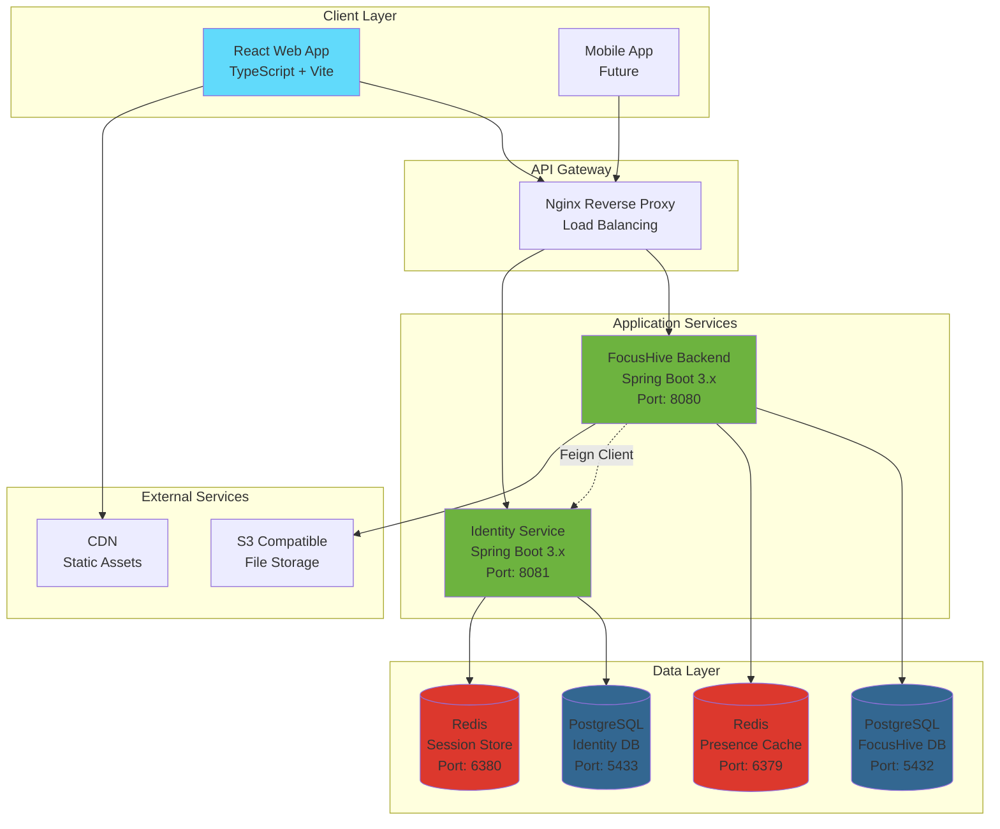
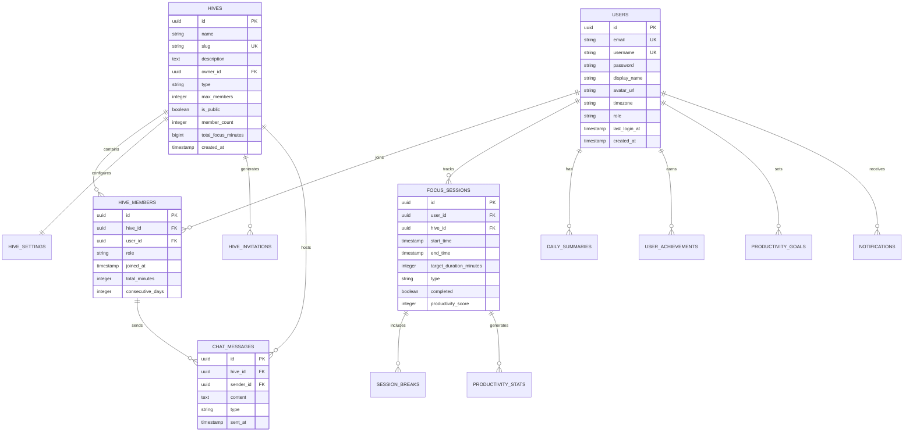
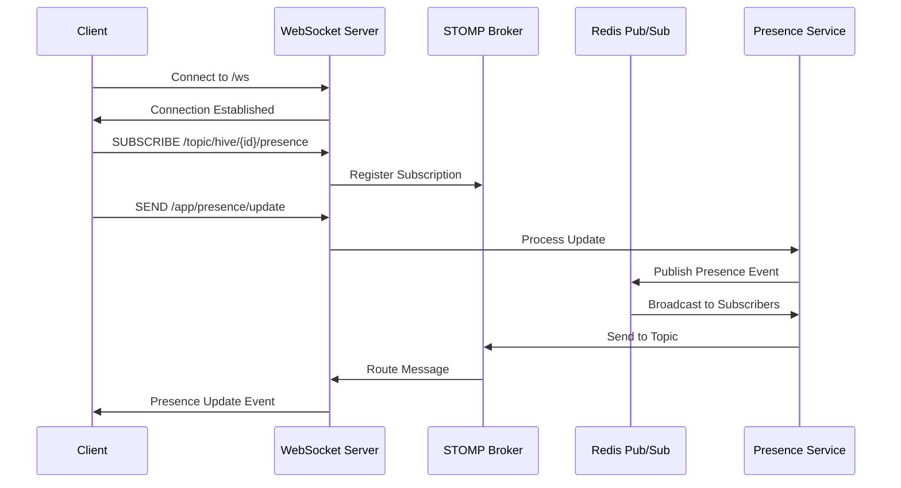
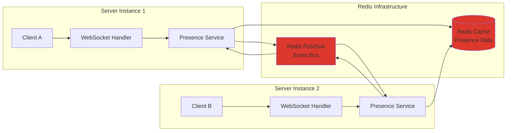
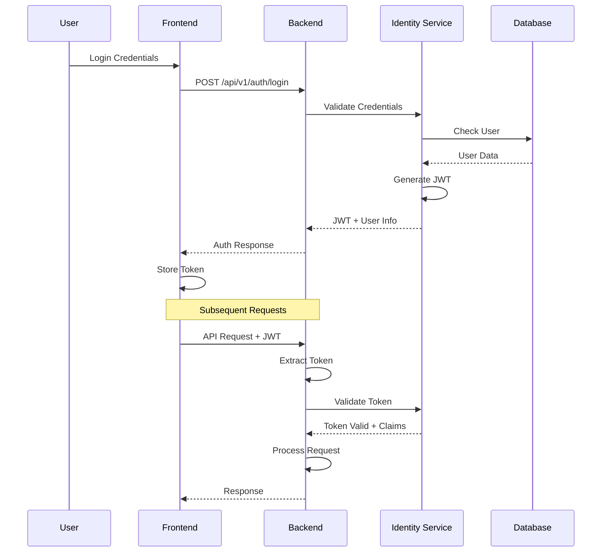

# Chapter 3: Design

## 3.1 Introduction

The design of FocusHive represents a modern approach to virtual co-working platforms, employing a microservices architecture that prioritizes real-time collaboration, scalability, and user privacy. This chapter presents the architectural decisions, database schema, API design, and real-time communication infrastructure that form the foundation of the FocusHive platform. The system architecture leverages Spring Boot microservices, WebSocket-based real-time communication, and a robust security framework to create an environment where users can maintain focus while benefiting from virtual co-presence.

## 3.2 System Architecture Overview

FocusHive employs a distributed microservices architecture designed to ensure scalability, maintainability, and separation of concerns. The architecture consists of three primary services: the FocusHive Backend service handling core business logic, the Identity Service managing authentication and user personas, and the React-based web frontend providing the user interface.



The microservices communicate through REST APIs and asynchronous messaging, with the FocusHive Backend utilizing a Feign client (`/backend/src/main/java/com/focushive/api/client/IdentityServiceClient.java`) to interact with the Identity Service. This architectural pattern ensures loose coupling between services while maintaining efficient inter-service communication.

## 3.3 Database Design

The database schema reflects the domain model of a virtual co-working platform, with careful attention to relationships, performance optimization, and data integrity. The system utilizes two separate PostgreSQL databases: one for the main application and another for the identity service, ensuring complete separation of authentication concerns.



The database migrations (located in `/backend/src/main/resources/db/migration/`) implement sophisticated features including:

- Automatic timestamp management through PostgreSQL triggers
- Composite indexes for query optimization on frequently accessed patterns
- JSON columns for flexible metadata storage
- Referential integrity constraints with appropriate cascade rules
- Soft deletion support for data recovery and audit trails

## 3.4 API Design

The RESTful API architecture follows industry best practices with consistent endpoint patterns, proper HTTP verb usage, and comprehensive error handling. The API is documented using OpenAPI 3.0 specifications, enabling automatic client generation and interactive documentation.

### 3.4.1 REST Endpoint Patterns

The API design maintains consistency across all resources:

```
Authentication & Identity:
POST   /api/v1/auth/login          - User authentication
POST   /api/v1/auth/refresh        - Token refresh
POST   /api/v1/auth/validate       - Token validation
GET    /api/v1/users/{id}/personas - Retrieve user personas

Hive Management:
GET    /api/v1/hives               - List public hives
POST   /api/v1/hives               - Create new hive
GET    /api/v1/hives/{id}          - Get hive details
PUT    /api/v1/hives/{id}          - Update hive
DELETE /api/v1/hives/{id}          - Delete hive
POST   /api/v1/hives/{id}/join     - Join hive
POST   /api/v1/hives/{id}/leave    - Leave hive

Presence & Real-time:
GET    /api/v1/presence/hive/{id}  - Get hive presence info
POST   /api/v1/presence/update     - Update user presence
WS     /ws                         - WebSocket connection endpoint

Analytics & Productivity:
GET    /api/v1/analytics/stats     - User statistics
POST   /api/v1/sessions/start      - Start focus session
POST   /api/v1/sessions/{id}/end   - End focus session
GET    /api/v1/analytics/daily     - Daily summaries
```

### 3.4.2 Request/Response Examples

The API utilizes consistent request and response structures with proper content negotiation:

```json
// Create Hive Request
POST /api/v1/hives
{
  "name": "Deep Work Haven",
  "description": "A quiet space for focused coding",
  "type": "WORK",
  "maxMembers": 25,
  "isPublic": true,
  "settings": {
    "minFocusDuration": 25,
    "maxBreakDuration": 5,
    "features": {
      "chat": true,
      "leaderboard": true
    }
  }
}

// Presence Update via WebSocket
SEND /app/presence/update
{
  "hiveId": "123e4567-e89b-12d3-a456-426614174000",
  "status": "FOCUSING",
  "activity": "Writing code",
  "focusSessionId": "987fcdeb-51a2-43f1-b123-5678901234cd"
}
```

## 3.5 Real-time Architecture

The real-time communication layer represents a critical component of FocusHive's virtual co-presence experience. The architecture combines Spring's WebSocket support with Redis publish/subscribe for scalable message distribution across multiple server instances.

### 3.5.1 WebSocket and STOMP Implementation

The WebSocket configuration (`/backend/src/main/java/com/focushive/presence/config/WebSocketConfig.java`) establishes a STOMP (Simple Text Oriented Messaging Protocol) broker that manages real-time message routing:



The STOMP broker configuration enables three destination types:
- `/topic/*` - Public broadcast channels for hive-wide events
- `/queue/*` - Private point-to-point messaging
- `/user/*` - User-specific destinations for personalized updates

### 3.5.2 Redis Integration for Scalability

Redis serves dual purposes in the real-time architecture: as a presence data cache and as a message broker for horizontal scaling. The Redis configuration (`/backend/src/main/java/com/focushive/presence/config/RedisPresenceConfig.java`) implements custom serialization to handle complex presence objects:



This architecture ensures that presence updates from any server instance are immediately propagated to all connected clients, regardless of which server they're connected to.

## 3.6 Security Architecture

Security in FocusHive follows a defense-in-depth approach with multiple layers of protection. The system implements JWT-based authentication with the Identity Service acting as the central authentication authority.

### 3.6.1 JWT Authentication Flow

The authentication flow integrates the Identity Service to provide centralized user management and support for multiple personas:



### 3.6.2 Authorization Patterns

The authorization system implements role-based access control (RBAC) at multiple levels:

1. **System-level roles**: USER and ADMIN defined in the users table
2. **Hive-level roles**: OWNER, MODERATOR, and MEMBER for granular permissions
3. **Resource-level checks**: Ownership validation for user-generated content

The Spring Security configuration (`/backend/src/main/java/com/focushive/api/config/SecurityConfig.java`) enforces these authorization rules through method-level security annotations and custom authentication filters.

## 3.7 Design Decisions and Rationale

Several key architectural decisions shaped the FocusHive platform:

**Microservices over Monolith**: The separation of identity management into a dedicated service enables independent scaling, specialized security measures, and potential federation with external identity providers. This aligns with the CM3035 template requirement for advanced identity management.

**WebSocket with STOMP**: Rather than raw WebSocket connections, STOMP provides a higher-level protocol with built-in message routing, making it easier to implement complex real-time features like presence broadcasting and chat functionality.

**Redis for Presence State**: Using Redis as a presence cache rather than PostgreSQL reduces database load and provides sub-millisecond access times crucial for real-time features. The pub/sub capability enables horizontal scaling without complex message queue infrastructure.

**Separate Databases**: Maintaining separate databases for the main application and identity service ensures complete data isolation, simplifies compliance requirements, and allows independent backup and scaling strategies.

**Event-Driven Updates**: The system uses database triggers and event patterns to maintain consistency in derived data (like daily summaries and hive statistics), reducing application complexity and ensuring data integrity.

## 3.8 Conclusion

The FocusHive design represents a carefully architected solution to the challenges of virtual co-working platforms. By combining modern microservices patterns, real-time communication infrastructure, and robust security measures, the system provides a foundation for scalable, maintainable growth. The architectural decisions prioritize user experience through low-latency updates while maintaining the flexibility to evolve with changing requirements. This design forms the technical foundation for implementing FocusHive's vision of enhanced productivity through virtual co-presence.