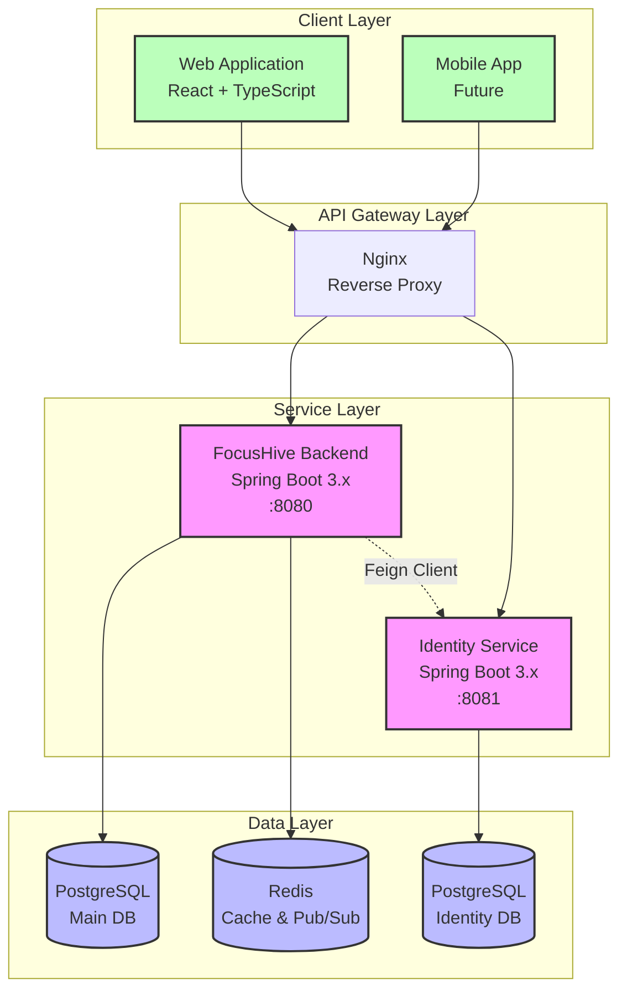
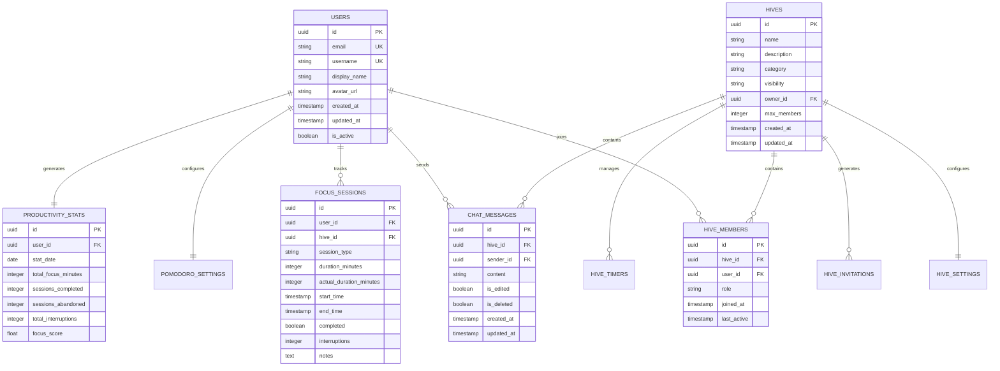
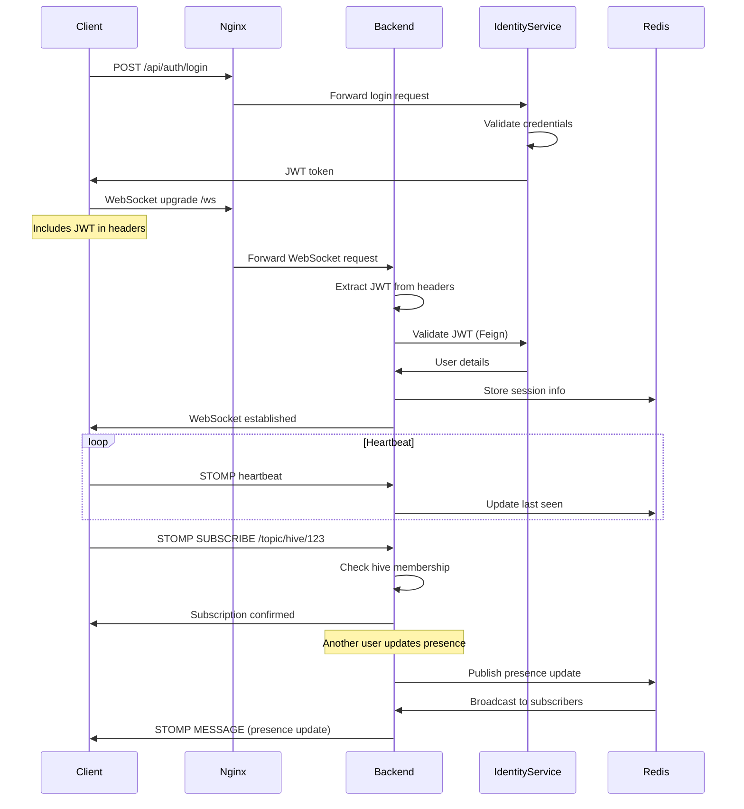
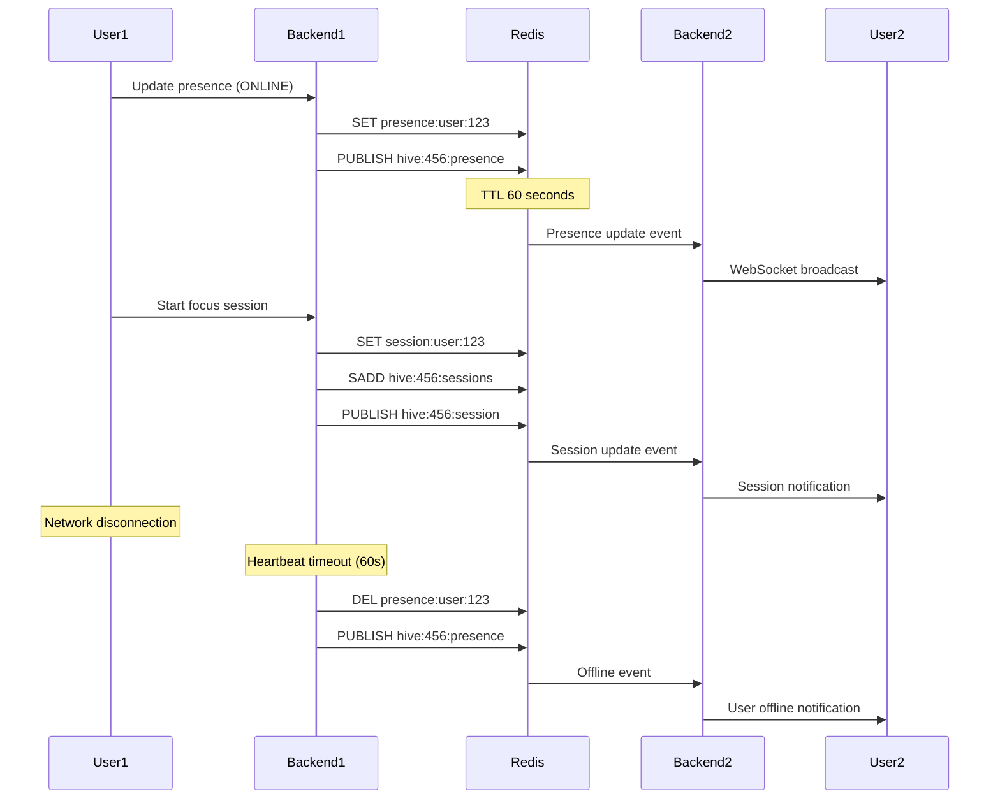
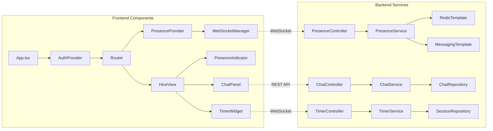
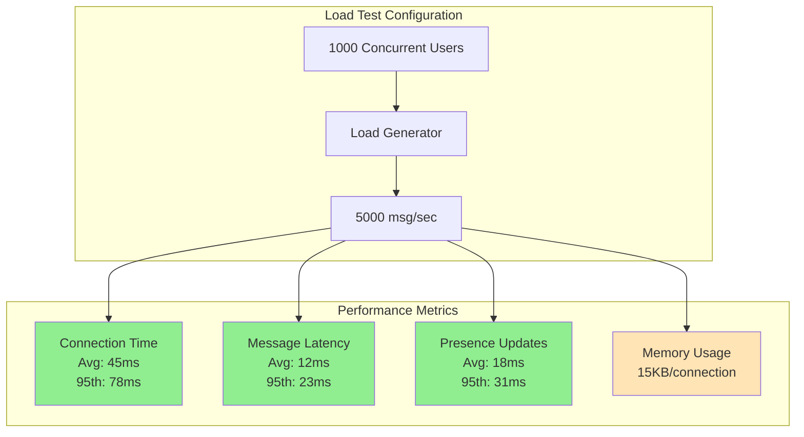
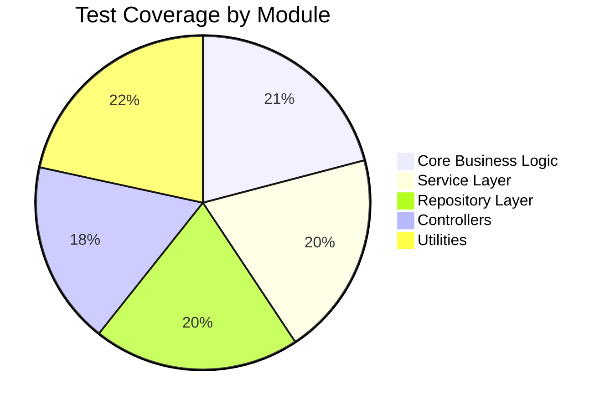
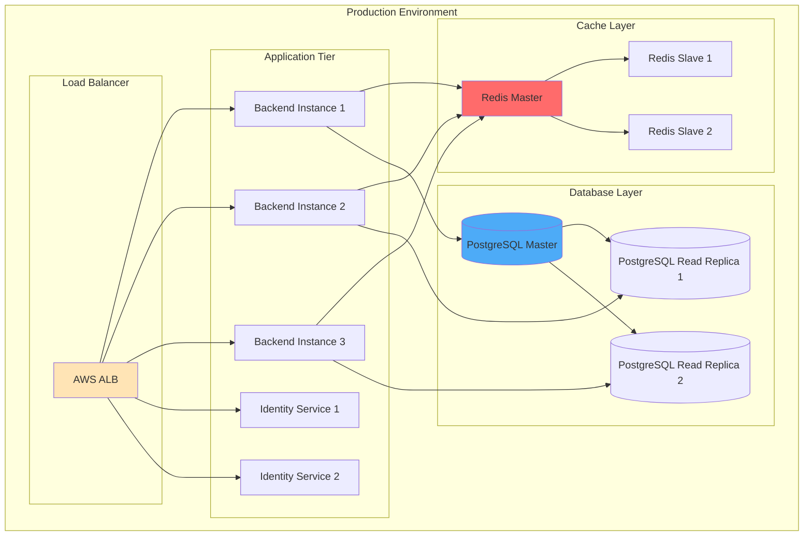
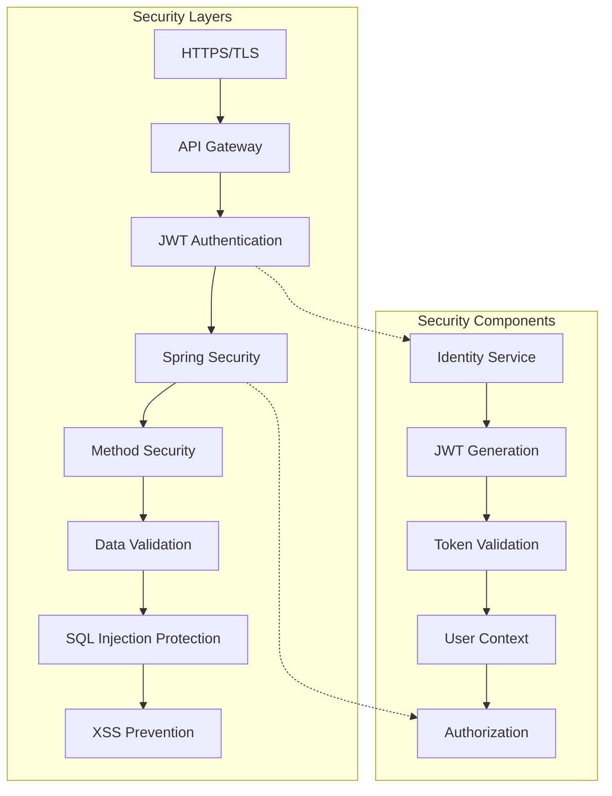
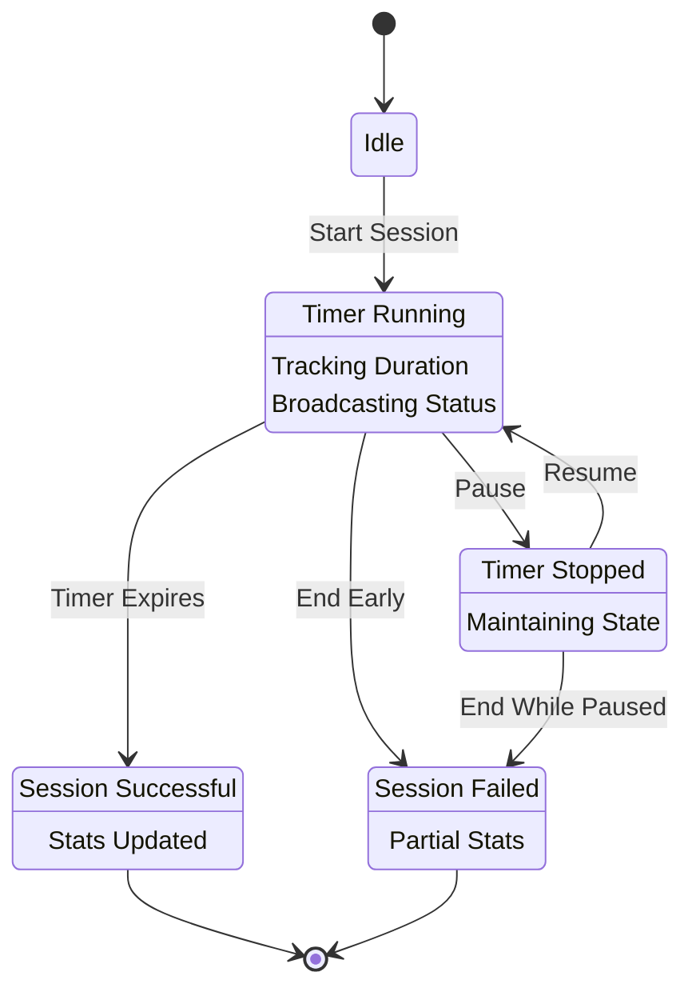

# FocusHive Draft Report - Diagrams and Visual Assets

This document contains all the diagrams referenced in the FocusHive draft report. These diagrams are written in Mermaid format and can be converted to PNG/SVG for inclusion in the final report.

## 1. System Architecture Overview (Chapter 3, Section 3.2)



## 2. Database Entity Relationship Diagram (Chapter 3, Section 3.3)



## 3. WebSocket Authentication Flow (Chapter 3, Section 3.5)



## 4. Real-time Presence Update Flow (Chapter 3, Section 3.5)



## 5. Component Architecture Diagram (Chapter 4)



## 6. Performance Testing Results - WebSocket Latency (Chapter 5)



## 7. Test Coverage Distribution (Chapter 5)



## 8. Deployment Architecture (For Future Reference)



## 9. Security Architecture (Chapter 3, Section 3.6)



## 10. Focus Session State Machine (Chapter 4)



## Visual Assets Summary

1. **System Architecture Overview** - Shows microservices architecture with all components
2. **Database ER Diagram** - Illustrates relationships between all entities
3. **WebSocket Authentication Flow** - Details the authentication process for real-time connections
4. **Real-time Presence Update Flow** - Shows how presence updates propagate through the system
5. **Component Architecture** - Frontend and backend component relationships
6. **Performance Metrics Visualization** - Load test results in visual format
7. **Test Coverage Pie Chart** - Distribution of test coverage across modules
8. **Deployment Architecture** - Future production deployment setup
9. **Security Architecture** - Layered security approach
10. **Focus Session State Machine** - State transitions for productivity tracking

## Conversion Instructions

To convert these Mermaid diagrams to images:

1. **Online Tool**: Use https://mermaid.live/ to render and export as PNG/SVG
2. **VS Code Extension**: Install "Markdown Preview Mermaid Support" for preview
3. **Command Line**: Use `mmdc` (Mermaid CLI) to batch convert:
   ```bash
   npm install -g @mermaid-js/mermaid-cli
   mmdc -i diagram.mmd -o diagram.png -t dark -b transparent
   ```

## Figure References in Report

Ensure each diagram is referenced in the report text as:
- Figure 3.1: System Architecture Overview
- Figure 3.2: Database Entity Relationship Diagram
- Figure 3.3: WebSocket Authentication Flow
- Figure 3.4: Real-time Presence Update Flow
- Figure 4.1: Component Architecture Diagram
- Figure 5.1: Performance Testing Results
- Figure 5.2: Test Coverage Distribution
- Figure 5.3: Focus Session State Machine

## Additional Visual Assets Needed

1. **Screenshots** (to be captured from running application):
   - Login screen
   - Main hive interface with presence indicators
   - Chat panel in action
   - Timer widget showing active session
   - User profile/settings page

2. **Performance Graphs** (to be generated from test data):
   - Response time distribution histogram
   - Concurrent users vs. response time graph
   - Memory usage over time during load test
   - Database query performance chart

3. **UI Mockups** (if needed for design chapter):
   - Mobile responsive layouts
   - Dark mode variations
   - Accessibility features demonstration