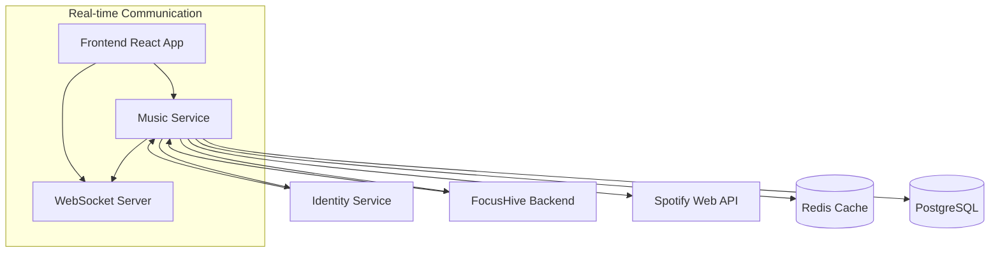

# FocusHive Music Service Integration Guide

## Overview

This guide provides comprehensive instructions for integrating the FocusHive Music Service with other microservices, frontend applications, and external systems. The Music Service follows event-driven architecture patterns and provides both REST API and WebSocket interfaces for seamless integration.

## Table of Contents

1. [Architecture Overview](#architecture-overview)
2. [Service Discovery](#service-discovery)
3. [Authentication & Authorization](#authentication--authorization)
4. [REST API Integration](#rest-api-integration)
5. [WebSocket Integration](#websocket-integration)
6. [Inter-Service Communication](#inter-service-communication)
7. [Event-Driven Architecture](#event-driven-architecture)
8. [Frontend Integration](#frontend-integration)
9. [Caching Strategy](#caching-strategy)
10. [Error Handling & Resilience](#error-handling--resilience)
11. [Monitoring & Observability](#monitoring--observability)
12. [Performance Considerations](#performance-considerations)
13. [Security Best Practices](#security-best-practices)
14. [Testing Integration](#testing-integration)
15. [Deployment & DevOps](#deployment--devops)

---

## Architecture Overview

### Service Ecosystem

The Music Service operates within the FocusHive microservices ecosystem and integrates with:



### Integration Patterns

1. **Synchronous Communication**: REST APIs for request-response operations
2. **Asynchronous Communication**: WebSocket for real-time updates
3. **Event-Driven**: Event publishing for state changes
4. **Circuit Breaker**: Resilience patterns for external service calls
5. **Caching**: Redis for performance optimization

---

## Service Discovery

### Local Development

```yaml
# docker-compose.yml
services:
  music-service:
    image: focushive/music-service:latest
    ports:
      - "8084:8084"
    environment:
      - IDENTITY_SERVICE_URL=http://identity-service:8082
      - BACKEND_SERVICE_URL=http://backend:8080
    networks:
      - focushive-network

  identity-service:
    image: focushive/identity-service:latest
    ports:
      - "8082:8082"

  backend:
    image: focushive/backend:latest
    ports:
      - "8080:8080"
```

### Production Environment

```yaml
# Kubernetes Service Discovery
apiVersion: v1
kind: Service
metadata:
  name: music-service
  labels:
    app: music-service
spec:
  selector:
    app: music-service
  ports:
  - name: http
    port: 8084
    targetPort: 8084
  - name: websocket
    port: 8085
    targetPort: 8085
  type: ClusterIP
```

### Service Registration

```java
// Kubernetes-based service discovery
@Component
public class ServiceDiscovery {
    
    @Value("${services.identity-service.url:http://identity-service:8082}")
    private String identityServiceUrl;
    
    @Value("${services.backend.url:http://backend:8080}")
    private String backendServiceUrl;
    
    public String getIdentityServiceUrl() {
        return identityServiceUrl;
    }
    
    public String getBackendServiceUrl() {
        return backendServiceUrl;
    }
}
```

---

## Authentication & Authorization

### JWT Token Validation

The Music Service validates JWT tokens issued by the Identity Service:

```java
@Configuration
@EnableWebSecurity
public class SecurityConfig {

    @Bean
    public JwtDecoder jwtDecoder(@Value("${identity-service.public-key-endpoint}") String publicKeyEndpoint) {
        return NimbusJwtDecoder.withJwkSetUri(publicKeyEndpoint).build();
    }

    @Bean
    public SecurityFilterChain filterChain(HttpSecurity http) throws Exception {
        return http
            .authorizeHttpRequests(auth -> auth
                .requestMatchers("/api/v1/music/health").permitAll()
                .requestMatchers("/api/v1/music/**").authenticated()
            )
            .oauth2ResourceServer(oauth2 -> oauth2.jwt(Customizer.withDefaults()))
            .build();
    }
}
```

### Service-to-Service Authentication

```java
@Component
public class ServiceAuthenticationClient {
    
    @Autowired
    private WebClient.Builder webClientBuilder;
    
    public Mono<String> getServiceToken() {
        return webClientBuilder.build()
            .post()
            .uri(identityServiceUrl + "/oauth2/token")
            .bodyValue(ClientCredentialsGrant.builder()
                .clientId(clientId)
                .clientSecret(clientSecret)
                .scope("music-service")
                .build())
            .retrieve()
            .bodyToMono(TokenResponse.class)
            .map(TokenResponse::getAccessToken);
    }
}
```

### Frontend Authentication

```typescript
// Frontend JWT token handling
import { useAuth } from '@/contexts/AuthContext'

const MusicApiClient = () => {
  const { token } = useAuth()
  
  const apiClient = axios.create({
    baseURL: process.env.VITE_MUSIC_SERVICE_URL,
    headers: {
      'Authorization': `Bearer ${token}`,
      'Content-Type': 'application/json'
    }
  })
  
  // Request interceptor for token refresh
  apiClient.interceptors.request.use(async (config) => {
    const currentToken = await getValidToken()
    config.headers.Authorization = `Bearer ${currentToken}`
    return config
  })
  
  return apiClient
}
```

---

## REST API Integration

### Client Configuration

#### Java/Spring Boot Integration

```java
@Configuration
public class MusicServiceClientConfig {

    @Bean
    public WebClient musicServiceClient(
            @Value("${music-service.url}") String baseUrl,
            @Qualifier("serviceTokenProvider") TokenProvider tokenProvider) {
        
        return WebClient.builder()
            .baseUrl(baseUrl)
            .defaultHeader(HttpHeaders.CONTENT_TYPE, MediaType.APPLICATION_JSON_VALUE)
            .filter(ExchangeFilterFunction.ofRequestProcessor(request -> {
                return tokenProvider.getToken()
                    .map(token -> ClientRequest.from(request)
                        .header(HttpHeaders.AUTHORIZATION, "Bearer " + token)
                        .build());
            }))
            .codecs(configurer -> configurer.defaultCodecs().maxInMemorySize(10 * 1024 * 1024))
            .build();
    }

    @Bean
    public MusicServiceClient musicServiceClient(WebClient musicServiceClient) {
        return new MusicServiceClient(musicServiceClient);
    }
}
```

#### Client Implementation

```java
@Component
public class MusicServiceClient {
    
    private final WebClient webClient;
    
    public MusicServiceClient(WebClient musicServiceClient) {
        this.webClient = musicServiceClient;
    }
    
    public Mono<RecommendationResponse> generateRecommendations(RecommendationRequest request) {
        return webClient
            .post()
            .uri("/api/v1/music/recommendations/sessions")
            .bodyValue(request)
            .retrieve()
            .onStatus(HttpStatusCode::isError, response -> {
                return response.bodyToMono(String.class)
                    .map(body -> new MusicServiceException("Failed to generate recommendations: " + body));
            })
            .bodyToMono(ApiResponse.class)
            .map(response -> response.getData())
            .cast(RecommendationResponse.class);
    }
    
    public Mono<Void> submitFeedback(String recommendationId, FeedbackRequest feedback) {
        return webClient
            .post()
            .uri("/api/v1/music/recommendations/{id}/feedback", recommendationId)
            .bodyValue(feedback)
            .retrieve()
            .bodyToMono(Void.class);
    }
}
```

### Circuit Breaker Implementation

```java
@Component
public class ResilientMusicServiceClient {
    
    private final MusicServiceClient client;
    private final CircuitBreaker circuitBreaker;
    
    public ResilientMusicServiceClient(MusicServiceClient client) {
        this.client = client;
        this.circuitBreaker = CircuitBreaker.ofDefaults("music-service");
        circuitBreaker.getEventPublisher().onStateTransition(event -> 
            log.info("Circuit breaker state transition: {}", event));
    }
    
    public Mono<RecommendationResponse> generateRecommendations(RecommendationRequest request) {
        return Mono.fromSupplier(CircuitBreaker.decorateSupplier(circuitBreaker, () ->
            client.generateRecommendations(request).block()))
            .onErrorResume(Exception.class, ex -> {
                log.warn("Music service call failed, using fallback", ex);
                return getFallbackRecommendations(request);
            });
    }
}
```

---

## WebSocket Integration

### Server Configuration

```java
@Configuration
@EnableWebSocket
public class WebSocketConfig implements WebSocketConfigurer {

    @Override
    public void registerWebSocketHandlers(WebSocketHandlerRegistry registry) {
        registry.addHandler(new MusicWebSocketHandler(), "/ws/music")
                .setAllowedOrigins("*")
                .withSockJS();
    }
}

@Component
public class MusicWebSocketHandler extends TextWebSocketHandler {
    
    private final Map<String, WebSocketSession> sessions = new ConcurrentHashMap<>();
    private final Map<String, Set<WebSocketSession>> hiveSessions = new ConcurrentHashMap<>();
    
    @Override
    public void afterConnectionEstablished(WebSocketSession session) throws Exception {
        String userId = getUserId(session);
        String hiveId = getHiveId(session);
        
        sessions.put(userId, session);
        hiveSessions.computeIfAbsent(hiveId, k -> ConcurrentHashMap.newKeySet()).add(session);
        
        log.info("User {} connected to hive {}", userId, hiveId);
    }
    
    @Override
    protected void handleTextMessage(WebSocketSession session, TextMessage message) throws Exception {
        WebSocketMessage wsMessage = objectMapper.readValue(message.getPayload(), WebSocketMessage.class);
        
        switch (wsMessage.getType()) {
            case "VOTE_TRACK":
                handleTrackVote(session, wsMessage);
                break;
            case "ADD_TO_QUEUE":
                handleAddToQueue(session, wsMessage);
                break;
            default:
                log.warn("Unknown message type: {}", wsMessage.getType());
        }
    }
    
    public void broadcastToHive(String hiveId, WebSocketMessage message) {
        Set<WebSocketSession> hiveSessions = this.hiveSessions.get(hiveId);
        if (hiveSessions != null) {
            String messageJson = objectMapper.writeValueAsString(message);
            hiveSessions.parallelStream()
                .filter(WebSocketSession::isOpen)
                .forEach(session -> {
                    try {
                        session.sendMessage(new TextMessage(messageJson));
                    } catch (IOException e) {
                        log.error("Failed to send message to session", e);
                    }
                });
        }
    }
}
```

### Client Integration

#### JavaScript/TypeScript WebSocket Client

```typescript
class MusicWebSocketClient {
    private ws: WebSocket | null = null
    private reconnectAttempts = 0
    private maxReconnectAttempts = 5
    private reconnectDelay = 1000
    
    constructor(
        private hiveId: string,
        private token: string,
        private onMessage: (message: WebSocketMessage) => void
    ) {}
    
    connect(): Promise<void> {
        return new Promise((resolve, reject) => {
            try {
                const wsUrl = `${process.env.VITE_MUSIC_WS_URL}/ws/music?hiveId=${this.hiveId}&token=${this.token}`
                this.ws = new WebSocket(wsUrl)
                
                this.ws.onopen = () => {
                    console.log('Music WebSocket connected')
                    this.reconnectAttempts = 0
                    resolve()
                }
                
                this.ws.onmessage = (event) => {
                    try {
                        const message: WebSocketMessage = JSON.parse(event.data)
                        this.onMessage(message)
                    } catch (error) {
                        console.error('Failed to parse WebSocket message:', error)
                    }
                }
                
                this.ws.onclose = () => {
                    console.log('Music WebSocket disconnected')
                    this.handleReconnection()
                }
                
                this.ws.onerror = (error) => {
                    console.error('Music WebSocket error:', error)
                    reject(error)
                }
                
            } catch (error) {
                reject(error)
            }
        })
    }
    
    private handleReconnection(): void {
        if (this.reconnectAttempts < this.maxReconnectAttempts) {
            this.reconnectAttempts++
            setTimeout(() => {
                console.log(`Attempting to reconnect... (${this.reconnectAttempts}/${this.maxReconnectAttempts})`)
                this.connect()
            }, this.reconnectDelay * Math.pow(2, this.reconnectAttempts))
        }
    }
    
    sendMessage(message: WebSocketMessage): void {
        if (this.ws && this.ws.readyState === WebSocket.OPEN) {
            this.ws.send(JSON.stringify(message))
        } else {
            console.warn('WebSocket is not connected')
        }
    }
    
    disconnect(): void {
        if (this.ws) {
            this.ws.close()
            this.ws = null
        }
    }
}
```

#### React Hook for WebSocket

```typescript
export const useMusicWebSocket = (hiveId: string) => {
    const [client, setClient] = useState<MusicWebSocketClient | null>(null)
    const [isConnected, setIsConnected] = useState(false)
    const [lastMessage, setLastMessage] = useState<WebSocketMessage | null>(null)
    const { token } = useAuth()
    
    useEffect(() => {
        if (hiveId && token) {
            const wsClient = new MusicWebSocketClient(
                hiveId,
                token,
                (message) => {
                    setLastMessage(message)
                    handleMessage(message)
                }
            )
            
            wsClient.connect()
                .then(() => setIsConnected(true))
                .catch(error => console.error('WebSocket connection failed:', error))
            
            setClient(wsClient)
            
            return () => {
                wsClient.disconnect()
                setIsConnected(false)
            }
        }
    }, [hiveId, token])
    
    const sendMessage = useCallback((message: WebSocketMessage) => {
        client?.sendMessage(message)
    }, [client])
    
    return { isConnected, sendMessage, lastMessage }
}
```

---

## Inter-Service Communication

### Feign Client Configuration

```java
@FeignClient(
    name = "user-service",
    url = "${services.user-service.url}",
    configuration = FeignConfiguration.class
)
public interface UserServiceClient {
    
    @GetMapping("/api/v1/users/{userId}")
    UserResponse getUser(@PathVariable String userId);
    
    @GetMapping("/api/v1/users/{userId}/preferences/music")
    MusicPreferencesResponse getMusicPreferences(@PathVariable String userId);
    
    @PostMapping("/api/v1/users/{userId}/activity")
    void recordActivity(@PathVariable String userId, @RequestBody ActivityRequest activity);
}

@FeignClient(
    name = "analytics-service", 
    url = "${services.analytics-service.url}",
    configuration = FeignConfiguration.class,
    fallback = AnalyticsServiceClientFallback.class
)
public interface AnalyticsServiceClient {
    
    @PostMapping("/api/v1/analytics/music/recommendation")
    void recordRecommendation(@RequestBody RecommendationAnalytics analytics);
    
    @PostMapping("/api/v1/analytics/music/feedback")
    void recordFeedback(@RequestBody FeedbackAnalytics analytics);
    
    @GetMapping("/api/v1/analytics/music/productivity/{userId}")
    ProductivityMetrics getProductivityMetrics(@PathVariable String userId);
}
```

### Fallback Implementation

```java
@Component
public class AnalyticsServiceClientFallback implements AnalyticsServiceClient {
    
    private static final Logger log = LoggerFactory.getLogger(AnalyticsServiceClientFallback.class);
    
    @Override
    public void recordRecommendation(RecommendationAnalytics analytics) {
        log.warn("Analytics service unavailable, recommendation not recorded: {}", analytics.getRecommendationId());
        // Could queue for later processing
    }
    
    @Override
    public void recordFeedback(FeedbackAnalytics analytics) {
        log.warn("Analytics service unavailable, feedback not recorded: {}", analytics.getFeedbackId());
        // Could queue for later processing
    }
    
    @Override
    public ProductivityMetrics getProductivityMetrics(String userId) {
        log.warn("Analytics service unavailable, returning default metrics for user: {}", userId);
        return ProductivityMetrics.defaultMetrics();
    }
}
```

---

## Event-Driven Architecture

### Event Publishing

```java
@Component
public class MusicEventPublisher {
    
    private final ApplicationEventPublisher eventPublisher;
    private final KafkaTemplate<String, Object> kafkaTemplate;
    
    public void publishRecommendationGenerated(String userId, String recommendationId, List<String> trackIds) {
        RecommendationGeneratedEvent event = RecommendationGeneratedEvent.builder()
            .userId(userId)
            .recommendationId(recommendationId)
            .trackIds(trackIds)
            .timestamp(Instant.now())
            .build();
        
        // Local event publishing
        eventPublisher.publishEvent(event);
        
        // External event publishing via Kafka
        kafkaTemplate.send("music.recommendation.generated", userId, event);
    }
    
    public void publishFeedbackReceived(String userId, String recommendationId, FeedbackRequest feedback) {
        FeedbackReceivedEvent event = FeedbackReceivedEvent.builder()
            .userId(userId)
            .recommendationId(recommendationId)
            .feedback(feedback)
            .timestamp(Instant.now())
            .build();
        
        eventPublisher.publishEvent(event);
        kafkaTemplate.send("music.feedback.received", userId, event);
    }
}
```

### Event Listeners

```java
@Component
public class MusicEventListener {
    
    private final AnalyticsServiceClient analyticsClient;
    private final UserServiceClient userClient;
    
    @EventListener
    @Async
    public void handleRecommendationGenerated(RecommendationGeneratedEvent event) {
        try {
            // Update user activity
            userClient.recordActivity(event.getUserId(), 
                ActivityRequest.builder()
                    .type("MUSIC_RECOMMENDATION")
                    .details(Map.of("recommendationId", event.getRecommendationId()))
                    .build());
            
            // Send to analytics
            analyticsClient.recordRecommendation(
                RecommendationAnalytics.fromEvent(event));
            
        } catch (Exception ex) {
            log.error("Failed to process recommendation generated event", ex);
        }
    }
    
    @KafkaListener(topics = "session.started", groupId = "music-service")
    public void handleSessionStarted(SessionStartedEvent event) {
        if (event.hasCoordinates()) {
            // Generate location-based music recommendations
            generateLocationBasedRecommendations(event);
        }
    }
}
```

---

## Frontend Integration

### React Context Integration

```typescript
// MusicServiceProvider.tsx
export const MusicServiceProvider: React.FC<{ children: React.ReactNode }> = ({ children }) => {
    const [state, setState] = useState<MusicState>(initialState)
    const { token } = useAuth()
    
    // Initialize API client
    const apiClient = useMemo(() => 
        createMusicApiClient(process.env.VITE_MUSIC_SERVICE_URL!, token), 
        [token]
    )
    
    // WebSocket connection
    const { sendMessage: sendWebSocketMessage } = useMusicWebSocket(state.currentHiveId)
    
    const generateRecommendations = useCallback(async (request: RecommendationRequest) => {
        setState(prev => ({ ...prev, isLoading: true }))
        
        try {
            const response = await apiClient.generateSessionRecommendations(request)
            setState(prev => ({
                ...prev,
                recommendations: response.data.tracks,
                isLoading: false
            }))
            
            return response.data.tracks
        } catch (error) {
            setState(prev => ({
                ...prev,
                error: error.message,
                isLoading: false
            }))
            throw error
        }
    }, [apiClient])
    
    const submitFeedback = useCallback(async (recommendationId: string, feedback: FeedbackRequest) => {
        await apiClient.submitFeedback(recommendationId, feedback)
        
        // Update local state optimistically
        setState(prev => ({
            ...prev,
            recommendations: prev.recommendations.map(track =>
                track.recommendationId === recommendationId
                    ? { ...track, userFeedback: feedback }
                    : track
            )
        }))
    }, [apiClient])
    
    const value: MusicContextType = {
        state,
        generateRecommendations,
        submitFeedback,
        // ... other methods
    }
    
    return (
        <MusicContext.Provider value={value}>
            {children}
        </MusicContext.Provider>
    )
}
```

### Component Integration Examples

```typescript
// Example: Hive Dashboard with Music Integration
const HiveDashboard: React.FC<{ hiveId: string }> = ({ hiveId }) => {
    const { generateRecommendations, state } = useMusicService()
    const { currentSession } = useHiveSession(hiveId)
    
    useEffect(() => {
        if (currentSession?.taskType) {
            // Generate recommendations based on hive session context
            generateRecommendations({
                hiveId,
                taskType: currentSession.taskType,
                mood: currentSession.mood,
                expectedDuration: currentSession.duration
            })
        }
    }, [currentSession, hiveId, generateRecommendations])
    
    return (
        <Box>
            <HiveHeader hiveId={hiveId} />
            
            <Grid container spacing={3}>
                <Grid item xs={12} md={8}>
                    <HiveWorkspace hiveId={hiveId} />
                </Grid>
                
                <Grid item xs={12} md={4}>
                    <Card>
                        <CardContent>
                            <Typography variant="h6" gutterBottom>
                                Music for Focus
                            </Typography>
                            
                            {state.recommendations.length > 0 && (
                                <MusicPlayer mode="mini" />
                            )}
                            
                            <CollaborativeQueue 
                                hiveId={hiveId}
                                showVoting={true}
                            />
                        </CardContent>
                    </Card>
                </Grid>
            </Grid>
        </Box>
    )
}
```

---

## Caching Strategy

### Redis Configuration

```java
@Configuration
@EnableCaching
public class RedisCacheConfig {

    @Bean
    public CacheManager cacheManager(RedisConnectionFactory connectionFactory) {
        RedisCacheConfiguration config = RedisCacheConfiguration.defaultCacheConfig()
            .entryTtl(Duration.ofMinutes(60))
            .serializeKeysWith(RedisSerializationContext.SerializationPair.fromSerializer(new StringRedisSerializer()))
            .serializeValuesWith(RedisSerializationContext.SerializationPair.fromSerializer(new GenericJackson2JsonRedisSerializer()));

        Map<String, RedisCacheConfiguration> cacheConfigurations = Map.of(
            "recommendations", config.entryTtl(Duration.ofHours(1)),
            "user-preferences", config.entryTtl(Duration.ofHours(6)),
            "analytics", config.entryTtl(Duration.ofMinutes(30)),
            "spotify-data", config.entryTtl(Duration.ofHours(24))
        );

        return RedisCacheManager.builder(connectionFactory)
            .cacheDefaults(config)
            .withInitialCacheConfigurations(cacheConfigurations)
            .build();
    }
}
```

### Cache Implementation

```java
@Service
public class RecommendationCacheService {
    
    private final RedisTemplate<String, Object> redisTemplate;
    
    @Cacheable(value = "recommendations", key = "#request.cacheKey")
    public RecommendationResponse getCachedRecommendations(RecommendationRequest request) {
        return null; // Will trigger cache miss and delegate to actual method
    }
    
    @CachePut(value = "recommendations", key = "#request.cacheKey")
    public RecommendationResponse cacheRecommendations(RecommendationRequest request, RecommendationResponse response) {
        return response;
    }
    
    @CacheEvict(value = "recommendations", key = "#userId + ':*'", allEntries = true)
    public void evictUserRecommendations(String userId) {
        log.info("Evicted all recommendation cache entries for user: {}", userId);
    }
    
    public void warmupCache(String userId) {
        // Pre-populate cache with commonly requested recommendations
        List<String> commonTaskTypes = List.of("DEEP_WORK", "CREATIVE", "ADMINISTRATIVE");
        
        commonTaskTypes.forEach(taskType -> {
            RecommendationRequest request = RecommendationRequest.builder()
                .userId(userId)
                .taskType(taskType)
                .build();
            
            try {
                // Generate and cache recommendations proactively
                generateRecommendations(request);
            } catch (Exception ex) {
                log.warn("Failed to warm up cache for user {} and task type {}", userId, taskType, ex);
            }
        });
    }
}
```

---

## Error Handling & Resilience

### Global Exception Handler

```java
@ControllerAdvice
public class MusicServiceExceptionHandler {

    @ExceptionHandler(SpotifyIntegrationException.class)
    public ResponseEntity<ErrorResponse> handleSpotifyException(SpotifyIntegrationException ex) {
        ErrorResponse error = ErrorResponse.builder()
            .code("SPOTIFY_ERROR")
            .message("Spotify integration error: " + ex.getMessage())
            .timestamp(Instant.now())
            .details(Map.of("spotifyError", ex.getSpotifyErrorCode()))
            .build();
        
        return ResponseEntity.status(HttpStatus.BAD_GATEWAY).body(error);
    }

    @ExceptionHandler(RecommendationException.class)
    public ResponseEntity<ErrorResponse> handleRecommendationException(RecommendationException ex) {
        ErrorResponse error = ErrorResponse.builder()
            .code("RECOMMENDATION_ERROR")
            .message("Failed to generate recommendations: " + ex.getMessage())
            .timestamp(Instant.now())
            .build();
        
        return ResponseEntity.status(HttpStatus.UNPROCESSABLE_ENTITY).body(error);
    }

    @ExceptionHandler(Exception.class)
    public ResponseEntity<ErrorResponse> handleGenericException(Exception ex) {
        ErrorResponse error = ErrorResponse.builder()
            .code("INTERNAL_ERROR")
            .message("An unexpected error occurred")
            .timestamp(Instant.now())
            .build();
        
        return ResponseEntity.status(HttpStatus.INTERNAL_SERVER_ERROR).body(error);
    }
}
```

### Circuit Breaker Configuration

```java
@Configuration
public class CircuitBreakerConfig {

    @Bean
    public CircuitBreakerRegistry circuitBreakerRegistry() {
        CircuitBreakerConfig config = CircuitBreakerConfig.custom()
            .failureRateThreshold(50)
            .waitDurationInOpenState(Duration.ofMillis(30000))
            .slidingWindowSize(10)
            .minimumNumberOfCalls(5)
            .build();

        return CircuitBreakerRegistry.of(config);
    }

    @Bean
    public CircuitBreaker spotifyCircuitBreaker(CircuitBreakerRegistry registry) {
        return registry.circuitBreaker("spotify", CircuitBreakerConfig.custom()
            .failureRateThreshold(60)
            .waitDurationInOpenState(Duration.ofSeconds(60))
            .build());
    }
}
```

### Retry Configuration

```java
@Configuration
public class RetryConfig {

    @Bean
    public RetryRegistry retryRegistry() {
        RetryConfig config = RetryConfig.custom()
            .maxAttempts(3)
            .waitDuration(Duration.ofMillis(1000))
            .retryOnResult(response -> response == null)
            .retryExceptions(IOException.class, TimeoutException.class)
            .ignoreExceptions(IllegalArgumentException.class)
            .build();

        return RetryRegistry.of(config);
    }
}
```

---

## Monitoring & Observability

### Metrics Configuration

```java
@Configuration
public class MetricsConfig {

    @Bean
    public MeterRegistry meterRegistry() {
        return new PrometheusMeterRegistry(PrometheusConfig.DEFAULT);
    }

    @Bean
    public TimedAspect timedAspect(MeterRegistry registry) {
        return new TimedAspect(registry);
    }

    @Bean
    public CountedAspect countedAspect(MeterRegistry registry) {
        return new CountedAspect(registry);
    }
}

@Service
public class MetricsService {
    
    private final MeterRegistry meterRegistry;
    private final Counter recommendationCounter;
    private final Timer recommendationTimer;
    private final Gauge activeWebSocketConnections;
    
    public MetricsService(MeterRegistry meterRegistry) {
        this.meterRegistry = meterRegistry;
        this.recommendationCounter = Counter.builder("music.recommendations.generated")
            .description("Number of recommendations generated")
            .tag("service", "music")
            .register(meterRegistry);
        
        this.recommendationTimer = Timer.builder("music.recommendations.duration")
            .description("Time taken to generate recommendations")
            .register(meterRegistry);
        
        this.activeWebSocketConnections = Gauge.builder("music.websocket.connections.active")
            .description("Active WebSocket connections")
            .register(meterRegistry, this, MetricsService::getActiveConnections);
    }
    
    public void recordRecommendationGenerated(String taskType, String mood) {
        recommendationCounter.increment(
            Tags.of(
                Tag.of("task.type", taskType),
                Tag.of("mood", mood)
            )
        );
    }
    
    public Timer.Sample startRecommendationTimer() {
        return Timer.start(meterRegistry);
    }
    
    private double getActiveConnections() {
        // Return actual count of active WebSocket connections
        return webSocketHandler.getActiveConnectionCount();
    }
}
```

### Distributed Tracing

```java
@Configuration
public class TracingConfig {

    @Bean
    public Sender sender() {
        return OkHttpSender.create("http://jaeger:14268/api/traces");
    }

    @Bean
    public AsyncReporter<Span> spanReporter() {
        return AsyncReporter.create(sender());
    }

    @Bean
    public Tracing tracing() {
        return Tracing.newBuilder()
            .localServiceName("music-service")
            .spanReporter(spanReporter())
            .sampler(Sampler.create(0.1f))
            .build();
    }
}

@Component
public class TracingService {
    
    private final Tracing tracing;
    
    public Span startSpan(String operationName) {
        return tracing.tracer()
            .nextSpan()
            .name(operationName)
            .tag("service", "music")
            .start();
    }
    
    public void addSpanTag(Span span, String key, String value) {
        span.tag(key, value);
    }
    
    public void finishSpan(Span span, Throwable error) {
        if (error != null) {
            span.tag("error", error.getMessage());
        }
        span.end();
    }
}
```

### Health Checks

```java
@Component
public class MusicServiceHealthIndicator implements HealthIndicator {
    
    private final SpotifyIntegrationService spotifyService;
    private final RedisTemplate<String, Object> redisTemplate;
    private final DataSource dataSource;
    
    @Override
    public Health health() {
        Health.Builder builder = Health.up();
        
        // Check database connectivity
        try (Connection connection = dataSource.getConnection()) {
            builder.withDetail("database", "UP");
        } catch (SQLException e) {
            builder.down().withDetail("database", "DOWN: " + e.getMessage());
        }
        
        // Check Redis connectivity
        try {
            redisTemplate.opsForValue().get("health-check");
            builder.withDetail("redis", "UP");
        } catch (Exception e) {
            builder.withDetail("redis", "DOWN: " + e.getMessage());
        }
        
        // Check Spotify API connectivity
        try {
            spotifyService.healthCheck();
            builder.withDetail("spotify", "UP");
        } catch (Exception e) {
            builder.withDetail("spotify", "DOWN: " + e.getMessage());
        }
        
        return builder.build();
    }
}
```

---

## Performance Considerations

### Database Optimization

```sql
-- Create indexes for common queries
CREATE INDEX CONCURRENTLY idx_recommendation_history_user_created 
ON music.recommendation_history(user_id, created_at DESC);

CREATE INDEX CONCURRENTLY idx_recommendation_history_performance 
ON music.recommendation_history(user_id, average_rating, acceptance_rate) 
WHERE average_rating >= 4.0;

CREATE INDEX CONCURRENTLY idx_recommendation_feedback_user_time 
ON music.recommendation_feedback(user_id, feedback_at DESC);

-- Partitioning for large tables
CREATE TABLE music.recommendation_history_2025_08 
PARTITION OF music.recommendation_history
FOR VALUES FROM ('2025-08-01') TO ('2025-09-01');
```

### Connection Pool Configuration

```yaml
# application.yml
spring:
  datasource:
    hikari:
      maximum-pool-size: 20
      minimum-idle: 5
      connection-timeout: 30000
      idle-timeout: 600000
      max-lifetime: 1800000
      leak-detection-threshold: 60000
  
  redis:
    jedis:
      pool:
        max-active: 20
        max-idle: 8
        min-idle: 2
        max-wait: 2000ms
```

### Async Processing

```java
@Configuration
@EnableAsync
public class AsyncConfig implements AsyncConfigurer {

    @Override
    @Bean(name = "taskExecutor")
    public Executor getAsyncExecutor() {
        ThreadPoolTaskExecutor executor = new ThreadPoolTaskExecutor();
        executor.setCorePoolSize(10);
        executor.setMaxPoolSize(20);
        executor.setQueueCapacity(100);
        executor.setThreadNamePrefix("Music-Async-");
        executor.setRejectedExecutionHandler(new ThreadPoolExecutor.CallerRunsPolicy());
        executor.initialize();
        return executor;
    }

    @Override
    public AsyncUncaughtExceptionHandler getAsyncUncaughtExceptionHandler() {
        return (exception, method, params) -> 
            log.error("Async execution error in method: {}", method.getName(), exception);
    }
}

@Service
public class AsyncRecommendationService {
    
    @Async("taskExecutor")
    public CompletableFuture<RecommendationResponse> generateRecommendationsAsync(RecommendationRequest request) {
        try {
            RecommendationResponse response = generateRecommendations(request);
            return CompletableFuture.completedFuture(response);
        } catch (Exception ex) {
            return CompletableFuture.failedFuture(ex);
        }
    }
}
```

---

## Security Best Practices

### Input Validation

```java
@RestController
@RequestMapping("/api/v1/music")
@Validated
public class RecommendationController {

    @PostMapping("/recommendations/sessions")
    public ResponseEntity<ApiResponse<RecommendationResponse>> generateRecommendations(
            @Valid @RequestBody RecommendationRequest request,
            Authentication authentication) {
        
        // Validate user access
        String userId = authentication.getName();
        if (!hasAccessToHive(userId, request.getHiveId())) {
            throw new AccessDeniedException("User does not have access to this hive");
        }
        
        // Validate request parameters
        validateRecommendationRequest(request);
        
        RecommendationResponse response = recommendationService.generateRecommendations(request);
        return ResponseEntity.ok(ApiResponse.success(response));
    }
    
    private void validateRecommendationRequest(RecommendationRequest request) {
        if (request.getMaxRecommendations() > 100) {
            throw new IllegalArgumentException("Maximum recommendations limit exceeded");
        }
        
        if (request.getExpectedDuration() > 480) { // 8 hours
            throw new IllegalArgumentException("Expected duration too long");
        }
    }
}
```

### Rate Limiting

```java
@Configuration
public class RateLimitingConfig {

    @Bean
    public RedisRateLimiter redisRateLimiter(ReactiveRedisTemplate<String, String> redisTemplate) {
        return new RedisRateLimiter(60, 100, 1); // 60 requests per minute, burst of 100
    }
}

@Component
public class RateLimitingInterceptor implements HandlerInterceptor {
    
    private final RedisRateLimiter rateLimiter;
    
    @Override
    public boolean preHandle(HttpServletRequest request, HttpServletResponse response, Object handler) {
        String userId = getUserId(request);
        String endpoint = request.getRequestURI();
        
        RateLimitResult result = rateLimiter.isAllowed(endpoint, userId);
        
        if (!result.isAllowed()) {
            response.setStatus(HttpStatus.TOO_MANY_REQUESTS.value());
            response.setHeader("X-RateLimit-Remaining", "0");
            response.setHeader("X-RateLimit-Retry-After", String.valueOf(result.getRetryAfter()));
            return false;
        }
        
        response.setHeader("X-RateLimit-Remaining", String.valueOf(result.getRemaining()));
        return true;
    }
}
```

### Data Encryption

```java
@Service
public class TokenEncryptionService {
    
    private final AESUtil aesUtil;
    
    @Value("${spotify.encryption.key}")
    private String encryptionKey;
    
    public String encryptSpotifyToken(String token) {
        try {
            return aesUtil.encrypt(token, encryptionKey);
        } catch (Exception e) {
            throw new SecurityException("Failed to encrypt Spotify token", e);
        }
    }
    
    public String decryptSpotifyToken(String encryptedToken) {
        try {
            return aesUtil.decrypt(encryptedToken, encryptionKey);
        } catch (Exception e) {
            throw new SecurityException("Failed to decrypt Spotify token", e);
        }
    }
}
```

---

## Testing Integration

### Integration Test Configuration

```java
@SpringBootTest(webEnvironment = SpringBootTest.WebEnvironment.RANDOM_PORT)
@TestPropertySource(locations = "classpath:application-integration-test.properties")
@Testcontainers
public class MusicServiceIntegrationTest {

    @Container
    static PostgreSQLContainer<?> postgres = new PostgreSQLContainer<>("postgres:14")
            .withDatabaseName("focushive_music_test")
            .withUsername("test")
            .withPassword("test");

    @Container
    static GenericContainer<?> redis = new GenericContainer<>("redis:7")
            .withExposedPorts(6379);

    @Autowired
    private TestRestTemplate restTemplate;

    @Autowired
    private WebSocketStompClient stompClient;

    @MockBean
    private SpotifyIntegrationService spotifyService;

    @Test
    public void testGenerateRecommendations() {
        // Given
        RecommendationRequest request = RecommendationRequest.builder()
            .taskType("DEEP_WORK")
            .mood("FOCUSED")
            .expectedDuration(120)
            .build();

        when(spotifyService.getRecommendations(any())).thenReturn(mockSpotifyTracks());

        // When
        ResponseEntity<ApiResponse> response = restTemplate.postForEntity(
            "/api/v1/music/recommendations/sessions",
            request,
            ApiResponse.class
        );

        // Then
        assertThat(response.getStatusCode()).isEqualTo(HttpStatus.OK);
        assertThat(response.getBody().isSuccess()).isTrue();
        
        RecommendationResponse recommendationResponse = (RecommendationResponse) response.getBody().getData();
        assertThat(recommendationResponse.getTracks()).hasSize(20);
        assertThat(recommendationResponse.getMetadata().getAlgorithms()).contains("content_based", "productivity_correlation");
    }

    @Test
    public void testWebSocketCollaborativeFeatures() throws Exception {
        // Given
        String hiveId = UUID.randomUUID().toString();
        BlockingQueue<WebSocketMessage> messages = new LinkedBlockingQueue<>();

        StompSession stompSession = stompClient.connect("ws://localhost:" + port + "/ws/music", new StompSessionHandlerAdapter() {})
            .get(5, TimeUnit.SECONDS);

        stompSession.subscribe("/topic/hive/" + hiveId, new StompFrameHandler() {
            @Override
            public Type getPayloadType(StompHeaders headers) {
                return WebSocketMessage.class;
            }

            @Override
            public void handleFrame(StompHeaders headers, Object payload) {
                messages.offer((WebSocketMessage) payload);
            }
        });

        // When
        WebSocketMessage voteMessage = WebSocketMessage.builder()
            .type("VOTE_TRACK")
            .payload(Map.of("trackId", "track123", "vote", "up"))
            .build();

        stompSession.send("/app/vote", voteMessage);

        // Then
        WebSocketMessage receivedMessage = messages.poll(5, TimeUnit.SECONDS);
        assertThat(receivedMessage).isNotNull();
        assertThat(receivedMessage.getType()).isEqualTo("TRACK_VOTED");
    }
}
```

### Contract Testing

```java
@ExtendWith(PactConsumerTestExt.class)
@PactTestFor(providerName = "user-service")
public class UserServiceContractTest {

    @Pact(consumer = "music-service")
    public RequestResponsePact getUserPreferences(PactDslWithProvider builder) {
        return builder
            .given("user exists with music preferences")
            .uponReceiving("a request for user music preferences")
                .path("/api/v1/users/123/preferences/music")
                .method("GET")
                .headers("Authorization", "Bearer token")
            .willRespondWith()
                .status(200)
                .body(new PactDslJsonBody()
                    .stringValue("userId", "123")
                    .array("preferredGenres")
                        .stringValue("classical")
                        .stringValue("ambient")
                        .closeArray()
                    .decimalType("energyLevel", 0.6)
                )
            .toPact();
    }

    @Test
    @PactTestFor
    void testGetUserPreferences(MockServer mockServer) {
        // Test implementation
    }
}
```

---

## Deployment & DevOps

### Docker Configuration

```dockerfile
# Multi-stage Dockerfile
FROM openjdk:21-jdk-slim as builder
WORKDIR /app
COPY . .
RUN ./gradlew build -x test

FROM openjdk:21-jre-slim
RUN apt-get update && apt-get install -y curl && rm -rf /var/lib/apt/lists/*
WORKDIR /app
COPY --from=builder /app/build/libs/music-service-*.jar app.jar

# Health check
HEALTHCHECK --interval=30s --timeout=10s --start-period=60s --retries=3 \
  CMD curl -f http://localhost:8084/actuator/health || exit 1

EXPOSE 8084
ENTRYPOINT ["java", "-jar", "app.jar"]
```

### Kubernetes Deployment

```yaml
apiVersion: apps/v1
kind: Deployment
metadata:
  name: music-service
  labels:
    app: music-service
spec:
  replicas: 3
  selector:
    matchLabels:
      app: music-service
  template:
    metadata:
      labels:
        app: music-service
    spec:
      containers:
      - name: music-service
        image: focushive/music-service:latest
        ports:
        - containerPort: 8084
        env:
        - name: SPRING_PROFILES_ACTIVE
          value: "kubernetes"
        - name: DB_HOST
          value: "postgres-service"
        - name: REDIS_HOST
          value: "redis-service"
        - name: SPOTIFY_CLIENT_ID
          valueFrom:
            secretKeyRef:
              name: spotify-secrets
              key: client-id
        - name: SPOTIFY_CLIENT_SECRET
          valueFrom:
            secretKeyRef:
              name: spotify-secrets
              key: client-secret
        resources:
          limits:
            memory: "1Gi"
            cpu: "500m"
          requests:
            memory: "512Mi"
            cpu: "250m"
        livenessProbe:
          httpGet:
            path: /actuator/health
            port: 8084
          initialDelaySeconds: 60
          periodSeconds: 30
        readinessProbe:
          httpGet:
            path: /actuator/health/readiness
            port: 8084
          initialDelaySeconds: 30
          periodSeconds: 10
```

### CI/CD Pipeline

```yaml
# .github/workflows/music-service.yml
name: Music Service CI/CD

on:
  push:
    branches: [ main, develop ]
    paths: [ 'music-service/**' ]
  pull_request:
    branches: [ main ]
    paths: [ 'music-service/**' ]

jobs:
  test:
    runs-on: ubuntu-latest
    services:
      postgres:
        image: postgres:14
        env:
          POSTGRES_DB: test_db
          POSTGRES_USER: test
          POSTGRES_PASSWORD: test
        ports:
          - 5432:5432
      redis:
        image: redis:7
        ports:
          - 6379:6379

    steps:
    - uses: actions/checkout@v3
    
    - name: Set up JDK 21
      uses: actions/setup-java@v3
      with:
        java-version: '21'
        distribution: 'temurin'
    
    - name: Cache Gradle packages
      uses: actions/cache@v3
      with:
        path: |
          ~/.gradle/caches
          ~/.gradle/wrapper
        key: ${{ runner.os }}-gradle-${{ hashFiles('**/*.gradle*', '**/gradle-wrapper.properties') }}
    
    - name: Run tests
      run: ./gradlew test integrationTest
      working-directory: music-service
    
    - name: Generate test report
      uses: dorny/test-reporter@v1
      if: success() || failure()
      with:
        name: Music Service Tests
        path: music-service/build/test-results/**/*.xml
        reporter: java-junit

  build-and-deploy:
    needs: test
    runs-on: ubuntu-latest
    if: github.ref == 'refs/heads/main'
    
    steps:
    - uses: actions/checkout@v3
    
    - name: Set up Docker Buildx
      uses: docker/setup-buildx-action@v2
    
    - name: Login to Container Registry
      uses: docker/login-action@v2
      with:
        registry: ghcr.io
        username: ${{ github.actor }}
        password: ${{ secrets.GITHUB_TOKEN }}
    
    - name: Build and push Docker image
      uses: docker/build-push-action@v4
      with:
        context: music-service
        push: true
        tags: |
          ghcr.io/focushive/music-service:latest
          ghcr.io/focushive/music-service:${{ github.sha }}
        cache-from: type=gha
        cache-to: type=gha,mode=max
    
    - name: Deploy to staging
      run: |
        kubectl set image deployment/music-service \
          music-service=ghcr.io/focushive/music-service:${{ github.sha }}
        kubectl rollout status deployment/music-service
```

---

## Conclusion

This integration guide provides comprehensive instructions for integrating the FocusHive Music Service across the entire technology stack. The service is designed to be:

- **Resilient**: Circuit breakers, retries, and fallbacks ensure stability
- **Scalable**: Stateless design with caching and async processing
- **Observable**: Comprehensive metrics, logging, and tracing
- **Secure**: Authentication, authorization, and data encryption
- **Testable**: Comprehensive test coverage with contract testing

For additional integration support:

- **API Documentation**: [Music Service API](../music-service/docs/API.md)
- **Service Documentation**: [Music Service README](../music-service/README.md)
- **Frontend Integration**: [Frontend Music Module](../frontend/src/features/music/README.md)
- **Architecture Decisions**: [ADR Documents](./adrs/)

---

**Last Updated**: August 7, 2025  
**Version**: 2.1.0  
**Contributors**: FocusHive Development Team